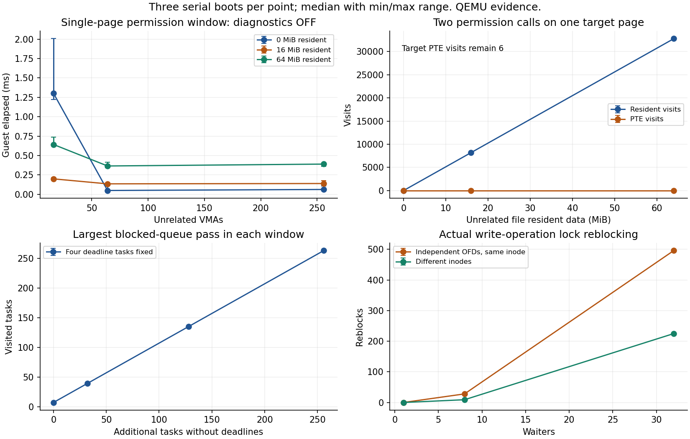

# 成本基线与归因

BoarOS 的慢写最初主要来自逐操作同步日志。组提交消除了这部分固定等待，
后续资源复用和批量 I/O 又减少了准备成本。最近的块缓存缺陷会把热命中变成读盘；
修复后自动模式的读请求减少约 68%，程序加同步收尾的耗时改善约 7%–8%。
收益没有按请求数同比增长，因为日志屏障、事务准备和前台复制仍然存在。

本文解释机制、实测结果与限制。开发方向见 [goals](../goals.md)，
实现契约见 [VFS/ext4](../modules/vfs-ext4.md)、[块设备](../modules/riscv-virtio-block.md)
和 [成本观测](../modules/kernel-cost.md)。不设置固定吞吐倍数作为开发准入条件。

## 怎样读这些数字

性能比较首先要对齐工作量、计时边界和正确性承诺。

| 指标 | 计时或统计范围 | 能回答的问题 |
|---|---|---|
| 程序耗时 | 启动 iozone 到等待其退出；包含程序自身的同步、关闭和协调 | 应用完成这条命令用了多久 |
| 程序后的同步收尾 | 对工作目录中剩余普通文件和目录执行 fsync | 应用要求的持久化目标还需等多久 |
| 剩余 checkpoint 与卸载 | 内核测试钩子测量最后的根盘卸载 | 程序之后还有多少后台工作和清理 |
| Parent 吞吐 | 实际传输量除以父进程阶段时间 | 这一阶段总体完成效率 |
| Children 吞吐 | 各子进程按自身计时得到的速率之和 | 子进程计时下的速率分布 |
| Max 吞吐 | 最快子进程的速率；原 judge 使用此字段 | 最快任务的表现 |

一次 fsync 收尾不等于完整 checkpoint 排空。后台工作可能已在程序执行时完成；
卸载的剩余时间也不等于全生命周期内的 checkpoint 总成本。
累计申请量不是驻留内存峰值，请求占比不是耗时占比，多任务等待和嵌套计时不能直接相加。

原参数为自动模式 `./iozone -a -r 1k -s 4m`，以及四进程
`./iozone -t 4 -i A -i B -r 1k -s 1m`。八组依次为自动模式、
`(0,1)`、`(0,2)`、`(0,3)`、`(0,5)`、`(6,7)`、`(9,10)`、`(11,12)`。
原 ELF 不支持最后一组的向量方法，在固定 Linux 上也如此；退出成功及回退输出不能算向量方法通过。
原参数没有把末尾 fsync/close 纳入自动模式和子进程自身的吞吐计时。
多进程 Parent 等待子进程退出，包含其末尾同步与关闭；整条命令的程序耗时也包含这些收尾。

常规消费者测量使用 QEMU 11.1.1、单 hart、512 MiB、modern/writeback，
DTB 时钟为 10 MHz。旧 glibc 消费者在 `oscomp-rv-compat` 的兼容配置运行；
默认 main 的 glibc 2.44 回归是另一套输入。1 GiB 原评测专项另列，不能与常规测量混用。
吞吐与耗时使用关闭新增成本观测的构建；开启观测的样本只用于归因。

### QEMU时间与宿主条件

固定10MHz timebase规定每个时钟tick为100ns，不规定每秒执行多少客户机指令。
当前`tests/cost-riscv.py`没有启用`-icount`。本地QEMU参考
`references/qemu`（v11.1.0，`84f07211cc5b4fc6a371559bf8a5de4fb068e648`）中，
`hw/intc/riscv_aclint.c`将`QEMU_CLOCK_VIRTUAL`换算为mtime；
`system/cpus.c`和`system/cpu-timers.c`的默认路径在VM运行时使用宿主单调时钟，
暂停时维护offset。`accel/tcg/tcg-accel-ops.c`仅在启用icount时改用指令计数时钟。
`docs/devel/tcg-icount.rst`也明确icount不是周期精确模拟。

因此，宿主CPU频率、核类型、被调度出去的时间和TCG翻译都会影响固定工作量耗时，
也可能放大客户机观察到的IRQ-off时间；绑P核只能控制运行位置，不能锁定频率。
本页各轮执行器身份分别固定，参考源码版本不充当实际QEMU二进制身份。
匹配测量记录CPU/频率策略、时钟模式、观测开关及返回基线漂移，结合确定性工作量计数归因，
不能把全部变慢归为宿主噪声，或把计数下降直接当成端到端加速。更改icount属于另一测量profile，
不能与这里的默认TCG时间拼接。

## iozone 各轮耗时

下表使用关闭观测的既有记录。程序耗时与八组程序合计均为三次独立启动的中位数。
八组原命令全部执行，最后一组向量方法不可用的事实继续保留。

| 轮次 | musl 自动程序/秒 | glibc 自动程序/秒 | musl 八组程序合计/秒 | glibc 八组程序合计/秒 |
|---|---:|---:|---:|---:|
| 组提交后 | 16.450 | 18.372 | 143.512 | 146.882 |
| 存储流水线后 | 12.646 | 14.318 | 132.187 | 136.222 |
| 缓存查询顺序纠错后 | 11.592 | 13.438 | 未重测 | 未重测 |

最近一轮只测自动模式和四进程读写，不能写成八组总耗时。
此前 1 GiB 原脚本专项的整个启动耗时为 269.309 秒，包含启动和脚本流程；
更早的组提交版同项为 293.532 秒。它们与逐程序耗时之和不同。

### 多进程总耗时为何会掩盖路径成本

原 iozone 3.506 的 `throughput_test()` 在阶段间多次执行 `sleep(2)`，
清理前后各有一次固定休眠。沿原参数对应的分支核对，名义休眠如下：

| 多进程参数组 | 固定休眠/秒 |
|---|---:|
| (0,1) | 12 |
| (0,2) | 16 |
| (0,3) | 12 |
| (0,5) | 12 |
| (6,7) | 8 |
| (9,10) | 12 |
| (11,12) 的原版本回退路径 | 8 |
| 每种 libc 合计 | **80** |

这些休眠计入程序退出时间，位于各方法吞吐计时之外。自动模式走 `auto_test()` / `begin()`，
没有这套固定阶段休眠。因此八组总耗时与自动模式对实际读写速度的敏感程度不同。
上轮 musl 八组 132.187 秒中，源码规定的休眠已有 80 秒；读写路径变快不会缩短这部分。
可用 `总耗时 = 固定休眠 + 读写、准备、同步、进程协调与清理` 理解，
但减去 80 秒后的剩余量仍不是纯设备服务时间，实际休眠也可能受调度延迟影响。

多进程组每个文件为 1 MiB，首个任务完成还可能提前停止其他任务；
自动模式使用一个任务、4 MiB 文件、1 KiB 请求，完成十三项方法。
两种模式的工作量、并发与停止规则不同，不能把倍率直接互换。

源码位于本地 `references/oscomp-testsuits` 的 `origin/pre-2025` 对象，入口为
`iozone/iozone.c::throughput_test`；阶段后休眠、额外阶段前休眠及清理路径均在此函数。
工作树未展开该路径时可用 `git -C references/oscomp-testsuits show origin/pre-2025:iozone/iozone.c` 阅读。

## 缓存查询顺序纠错（2026-10-01）

### 命中为什么会变成读盘

旧 `ext4_block_get_noread()` 在查找目标块之前回收缓存。工作集恰好为八块、
回收目标也是八块时，可能先淘汰本次要访问的块，随后重新读盘。
修复在设备状态与地址检查之后，先查询并取得已有缓存引用；只有未命中才回收。
回收可能睡眠，因此 allocator 仍再次查询，处理其他任务已经加载目标的交错。
命中不保证内容有效，加载等待与失败处理继续沿用原规则。

| 宿主受控负载 | 预热后访问次数 | 旧额外设备读 | 修复后额外设备读 | 峰值驻留块数 |
|---|---:|---:|---:|---:|
| 目标 8 块，循环访问 7 个热块 | 700 | 0 | 0 | 7 |
| 目标 8 块，循环访问 8 个热块 | 800 | 800 | 0 | 8 |
| 目标 8 块，另持引用 8 块，循环访问 1 个热块 | 100 | 100 | 0 | 9 |
| 目标 64 块，另持引用 8 块，循环访问 1 个热块 | 100 | 0 | 0 | 9 |

生产目标仍为八块，容量扩大不是本次收益来源。引用中的块不能随意淘汰，
所以回收目标不是严格的驻留上限。测试还覆盖脏块、日志引用、加载等待、
多引用、分配失败、加载和回收错误以及最终清理。

### 实际程序耗时

本次只比较两种 libc 的自动模式和四进程读写。协调器与五个 8 MiB 预置文件
改变了上一轮的初始状态，旧版本也运行相同配置，未直接套用上一轮八组序列数字。
每版本各三个串行独立启动，原程序与参数未修改。

| 原命令 | 旧程序中位/秒 | 新程序中位/秒 | 旧/新同步收尾中位/毫秒 | 旧/新程序加收尾中位/秒 |
|---|---:|---:|---:|---:|
| musl 自动 | 12.567 | 11.592 | 22.336 / 21.139 | 12.590 / 11.612 |
| glibc 自动 | 14.449 | 13.438 | 21.048 / 20.208 | 14.470 / 13.458 |
| musl 四进程读写 | 17.580 | 17.314 | 20.881 / 20.572 | 17.602 / 17.334 |
| glibc 四进程读写 | 17.806 | 17.939 | 23.354 / 19.877 | 17.828 / 17.958 |

自动模式的程序加收尾改善 7.76% / 6.99%。四进程整条命令的 musl 改善 1.52%，
glibc 增加 0.73%，这项没有改善。各列分别取中位数，不能将两列中位数相加
代替合计的中位数。逐命令完成标志与退出状态正常。

| 四进程条目，Parent 中位 kB/s | musl 旧 → 新 | glibc 旧 → 新 |
|---|---:|---:|
| initial writers | 1227.30 → 1368.73（+11.52%） | 1084.01 → 1247.38（+15.07%） |
| rewriters | 1791.87 → 1844.92（+2.96%） | 1744.64 → 1865.64（+6.94%） |
| readers | 31825.30 → 36306.37（+14.08%） | 42890.98 → 43404.22（+1.20%） |
| re-readers | 57099.65 → 57796.05（+1.22%） | 56979.20 → 58018.45（+1.82%） |

四条命令结束后，根卸载的剩余 checkpoint 与清理中位为旧 39.815 毫秒、新 44.257 毫秒。
该区间不包含调用之前的 worker 停止时间，不能据此推断整个后台阶段回退。
Max、Children、最少传输量与分布应分别核对，不能互相替代；原始输出由执行器生成。
本轮没有重测八组总耗时或专项分数。

### 请求少了，为什么只快了一部分

匹配的旧、新各一个观测启动用于读取来源归因，不作为重复性能分布。

| 自动窗口 | 全部设备请求旧 → 新 | 读请求旧 → 新 | 新文件/元数据/准备/未知读请求 | 提交组/FLUSH/checkpoint 批次，旧与新相同 |
|---|---:|---:|---:|---:|
| musl | 26616 → 14701 | 17399 → 5484（−68.48%） | 109 / 159 / 4097 / 1119 | 510 / 1547 / 222 |
| glibc | 26572 → 14751 | 17389 → 5568（−67.98%） | 178 / 166 / 4097 / 1127 | 510 / 1547 / 222 |

来源在实际设备发布处记录。准备类读取来自事务、日志或读改写路径，
不能仅凭标签判定全部可删除；无法证明的来源继续记为未知。
新 musl 自动窗口读约 22.46 MB，其中准备读取约 16.78 MB、未知读取约 4.58 MB。

缓存浪费减少，但提交组数和屏障没有改变。程序仍要执行时间更新、事务准备、
用户页解析、复制与同步等待，解释了请求下降远大于端到端耗时下降。
观测中 musl 前台运行约 5.584 秒、后台约 0.667 秒、idle 上下文约 7.742 秒；
这些不是关闭观测时的精确占比，跨任务和嵌套时间也不能直接相加。
后端锁重阻塞仍为零，本轮没有再改锁交接、调度或持久化机制。

整个启动的设备读跟踪显示请求 53952 → 27830，重复相同范围 42286 → 16164，
不同范围均为 11666。它包含初始化和报告生成，不能冒充单个窗口的重复率。
引用和驻留由宿主核对，未在热路径增加全缓存扫描。

自动模式的观测构建相对关闭观测增加约 21.58% / 14.49% 时间，
四进程命令增加约 9.16% / 7.41%。观测存储为 65483 字节、每任务 64 字节，默认关闭。
计数下降证明机制改进，实际收益仍以关闭观测的完成耗时为准。

### 并发读：完成量比最快任务更重要

固定工作量负载让四个工作者握手、统一开始，每个读 8 MiB、请求大小 1 KiB，
全部完成才结束。分别测试同 inode 的独立 OFD、不同 inode，以及冷读和预热读取。
所有工作者完成指定字节、内容校验与正常退出。

| 固定工作量，关闭观测各一次启动 | 旧秒 | 新秒 |
|---|---:|---:|
| 同 inode 冷读 | 0.882 | 0.940 |
| 同 inode 预热 | 0.401 | 0.398 |
| 不同 inode 冷读 | 1.198 | 1.217 |
| 不同 inode 预热 | 0.409 | 0.428 |

这组只有各一次启动，用于解释进展，不能当作稳定的吞吐回归结论。
观测中热读没有设备请求或缓存未命中；冷读同 inode 读取 2048 个文件块，
不同 inode 读取 8192 个，符合共享一次加载与四份独立数据的工作量。
热读后端锁无阻塞或重阻塞，四个任务均有进展；最大就绪等待约 30 毫秒，
与当前 OTHER 的 10 毫秒轮转量级相符。热读观测使负载慢约三倍，不能拿来报速度。

原 iozone 3.506 的 `thread_read_test` 在第一个任务完成后设置共享 `stop_flag`，
本次参数没有禁用这个停止规则。因此它不要求四个任务各自读完相同字节。
匹配的旧、新 musl 样本最少读传输量都为 5 KiB；这个数字本身不证明调度饥饿。
此前流水线轮次的 Parent 回退 17.05% 仍保留，尚未唯一证明是停止规则、
启动顺序还是后台竞争造成。本轮没有更换调度策略。

## 异步日志与组提交验收（2026-10-01）

普通非零文件写在用户复制前更新 mtime/ctime。旧 `ext4_file_touch()` 启动事务，
外层结束立即提交，使时间字段更新也承担同步持久化等待。
独立探针中，128 次纯时间更新产生 128 次 commit、256 次 FLUSH。
小写的数据复制很少，固定事务成本却按调用发生。

组提交将成功操作合入挂载点拥有的运行事务，冻结独立版本，由后台线程持久化。
本次操作失败只撤销自身修改，已经接受的其他操作和冻结版本不受影响。
慢 I/O 移出后端修改锁；FIFO 资格交接避免广播唤醒后反复争锁，
idle 的安全中断返回点处理已经就绪的任务。

| musl 自动模式的观测指标 | 逐操作提交 | 组提交后 |
|---|---:|---:|
| FLUSH 次数 | 96907 | 2123 |
| 设备请求次数 | 229097 | 28004 |
| 写设备字节 / 缓存接受字节 | 14.883 | 1.297 |
| 前台后端锁累计持有秒数 | 478.580 | 8.376 |

两侧缓存接受量同为 24 MiB。锁持有时间包含等待，不能叫 CPU 时间。
四写者重阻塞降为零。这些证据解释了当时五项写入 Max 吞吐改善 25.29–54.00 倍：
去掉的是旧路径每次调用的高固定成本，磁盘本身没有提高同样倍数的带宽。
自动程序耗时由 musl 415.066 秒、glibc 409.248 秒降到 16.450 / 18.372 秒。

重读的 Max 当时下降 36%–38%，但 Parent 提高 12%–13%，Children 下降 21%–24%。
三种字段使用不同分母，不能据最快子进程概括整个读路径退化。
普通读在 relatime 无需更新时不会创建日志事务。

## S9 存储流水线验收（2026-10-01）

轻量操作准备复用组级版本和有界资源池，保留每操作 undo 与成功前资源预留。
封口阈值和实际容量不足分开，达到操作数阈值不再直接要求等完整 checkpoint。
commit 后发布持久化序号，checkpoint 单独推进；同一 I/O 阶段最多八个 span 批量发布，
阶段之间保留必要屏障。热读无需更新 relatime 时使用共享查询资格。

| 自动窗口成本 | musl 组提交 → 流水线 | glibc 组提交 → 流水线 |
|---|---:|---:|
| 堆请求次数 | 522085 → 46048 | 522392 → 46328 |
| 封口提交组数 | 510 → 510 | 510 → 510 |
| 设备请求数 | 28004 → 26630 | 27970 → 26613 |
| FLUSH 次数 | 2123 → 1547 | 2123 → 1547 |
| 最大已发布在途请求 | 2 → 8 | 2 → 8 |
| 事务计费峰值/字节 | 2318336 → 1042944 | 2320768 → 1112768 |

分配请求减少约 91%，FLUSH 减少约 27%，但设备请求仅减少约 5%，提交组数不变。
事务峰值包含版本、日志、引用和池，不是全系统内存峰值。
musl 自动窗口仍有 24576 次 1 KiB 文件写、96 MiB 累计 staging 申请量、
85708 次用户页解析和 154169 次缓存探测。这些前台工作没有被日志池或设备批量消除。

程序加 fsync 收尾的三次中位为 musl 12.668 秒、glibc 14.339 秒，
相对组提交版改善 23.09% / 22.04%。十项代表写方法的 Parent 吞吐为前一轮的
0.98–1.88 倍，相对固定 Linux 仍慢约 23–89 倍。端到端性能预期没有达到，
不能将机制完成或恢复检查通过写成收益目标完成。

固定 4 MiB 自动读/重读中位变化约 −0.27% 至 −1.89%。四进程普通读的 Parent
则是 musl 37874.64 → 31418.54 kB/s（−17.05%），glibc 37657.32 → 39097.50（+3.82%）。
musl 的最快任务同时提高约 29.5%，最少传输量降到 5 KiB；这是任务分布变化，
唯一原因当时没有定位，不能用 Max 改善抵消总体回退。

短同步负载为 128 次 4 KiB 热覆盖。观测样本中 O_DSYNC 约 3.038 秒、
每次 fdatasync 约 3.367 秒；固定 Linux 的关闭观测样本约 0.382 / 0.389 秒。
开关不同且各为单样本，不能据此计算精确加速比，但可以确认同步仍有明显成本。
每项形成 128 个提交组、约 640 次 FLUSH。worker 在没有下一组待提交时立即做 checkpoint，
完成语义分离没有自动让阶段重叠或形成更大的同步批次。

一次 1 GiB 原专项的 musl / glibc 分数为 25.0271 / 25.3164，
此前为 24.8500 / 25.1791。代表写入项仍各一分，分数增加主要来自读项。
原 judge 取 Max；低于基线但为正的成绩仍给一分，压缩了速度差距。
原向量组回退后的普通写字段也被计分，不能据此宣称向量方法通过。
该历史专项只运行iozone，当时完整双架构Harness仍缺`kernel-la`。当前LA指定
矩阵已交付，原盘容器由oscomp-compat独立记录，见[LA模块](../modules/loongarch-boot.md)。

## 日志、持久化与剩余瓶颈

文件系统 journal 与串口内核日志用途不同。journal 保存元数据修改的恢复依据：
文件扩展可能同时改变数据、inode 和空闲块位图，只完成一部分会破坏结构。
普通 write 接受字节、fsync 持久化、文件系统结构恢复和应用事务原子性是不同承诺。
没有同步的内容仍可能丢失；存在 journal 不代表整个应用事务原子。

当前顺序是：

```text
操作被接受并在内存可见
  → 冻结独立版本
  → ordered data 与屏障
  → 元数据日志与屏障
  → commit 记录与屏障：此时已有可恢复的持久化依据
  → checkpoint 写回原位置
  → 持久更新日志起点，释放日志空间及旧版本
```

fsync 可以等待捕获的 durable 目标，不必一律等 checkpoint。
但日志空间、版本依赖、块复用和错误 owner 必须正确维护，不能只提前标记成功。
后续 checkpoint 使用已提交版本，不能写入较新的未提交内容。

正常 QEMU 性能测试不会频繁断电。恢复测试主动停止客体，并用稳定/易失版本模型
丢弃尚未 flush 的写入，检查重启后能否恢复。拔电、硬复位或内核崩溃都可能造成
未排空的非正常停止；杀掉 QEMU 不会自动清空宿主页缓存，因而“重启后还能读到”
不能代替持久化证明。必要屏障要保留，优化的是触发粒度、重复准备和等待边界。

S9与缓存纠错当时可以确认的剩余成本包括：

- 自动模式仍有 510 个提交组和 1547 次 FLUSH；缓存修复没有改变提交粒度。
- 准备类读取仍占新窗口的大部分读请求，哪些可以避免需按具体路径判断。
- 小请求仍发生临时页周转、用户页解析、复制、缓存查询和锁取得。
- 单个 mount 的 worker 串行选择 commit/checkpoint，封口队列为空时积极做 checkpoint。
- 完整文件同步使用保守的挂载点接纳序号，可能等待其他文件此前的修改；
  尚未量化为主要瓶颈，缩小依赖前须保留命名空间和跨句柄关系。

当前普通调度是 100 Hz OTHER 轮转，FIFO/RR 提供实时优先级和预算限制。
常见ready队列操作为O(1)，deadline仍遍历blocked。外部IRQ的S-mode返回只在idle安全边界调度；timer则保留对开中断内核线程的抢占，持有I/O锁也不自动禁止切换。此前将两条路径笼统写成“普通内核路径不抢占”不准确；分配器修复与实际边界见文末风险调查。
调度优化可能减少就绪等待和流水线空档，但不能消除必要屏障或补齐接口。
是否值得改，应看真实程序的完成→唤醒→就绪→运行时间线。

## 成本观测还揭示了什么

历史全成本测量覆盖 20 个配置、60 次串行启动、339 个完成窗口。
当时的消费者包含启动拒绝及预算截断，后来补测取得完整可用结果；
矩阵执行完成不等于每个原程序都通过。这些历史成本也不是当前路径的实测占比。

| 受控问题 | 已测事实 | 含义 |
|---|---|---|
| 小写固定成本 | 128 次 1 B 写累计申请 512 KiB staging 容量 | 每调用页级准备远大于有效字节；累计量不是峰值 |
| 改权外围扫描 | 单页两次改权、64 MiB 无关驻留下访问 32768 个 resident 项，PTE 访问仅 6 次 | 点操作仍承担范围外扫描 |
| VMA 规模 | 16/64/256 个无关 VMA 的 merge/recount 访问为 44/140/524 | 局部 PTE 成本不能代表整次操作 |
| deadline | 四个期限任务，额外无期限 blocked 从 0 增到 256 时最大访问从 7 增到 263 | 期限检查受无关任务数量影响 |
| 响应延迟 | 1 MiB 热复制观测中连续 IRQ-off 最大约 7.6–8.0 毫秒 | 长操作延迟完成观察；有未采样前后缀，不是硬实时上界 |



逐节点改权观测曾使窗口慢约 40.9 倍。优化判断要同时看关闭观测时间和独立访问计数，
不能拿诊断耗时当生产延迟。扫描证据不等于它们占整个系统的主要时间，
也不决定下一项应用工作必须先重构索引。

评价程序需同时看阶段耗时、有效 CPU 工作、阻塞与就绪等待、设备请求、缓存和内存、
每任务进展以及后台积压。分配少了、队列深了只是局部证据；例如只改善占关键路径
30% 的部分，即使该部分快十倍，整体也只快约 1.37 倍。
当时下一主线为完整loopback应用，现已交付；当前路线见goals，历史扫描不构成应用准入条件。

## 验证边界与重建入口

缓存纠错运行了相关 lwext4 元数据、组提交、恢复、加载与回收测试，
四种传输/缓存配置的 io-sleep，以及 SQLite DELETE/WAL 正常与重启恢复。
没有改变事务、写回或队列顺序，未重复整套大型故障矩阵。
此前异步日志和流水线变更另做了完整恢复矩阵与双盘隔离。
这些检查保护正确性和所有权，性能结论来自匹配负载的完成耗时与成本变化。

同轮用户环境补齐真实日志、只读 RTC 与根盘来源；原 BusyBox 55/55 和内容检查成功，
ABI 从 1091 增到 1118 条并与固定 Linux 匹配。完整 228 项程序清单本轮未重跑。
详见 [程序环境](../modules/program-environment.md)与 [程序清单](user-program-inventory.md)。

```sh
# 缓存机制与资源边界
make test-lwext4-cache-host test-lwext4-metadata-host test-lwext4-group-host test-lwext4-recovery-host

# 兼容分支：关闭观测用于计时
make COST_DIAGNOSTICS=0 ROOT_DRAIN_FIXTURE=1 BUILD_DIR=build/cost/correction-compat-off/riscv KERNEL_RV=build/cost/correction-compat-off/kernel-rv all
python3 -B tests/cost-riscv.py --case consumer --consumer-commands musl:0,musl:1,glibc:0,glibc:1 --replicas 3 --off --consumer-timeout-ms 900000 --kernel build/cost/correction-compat-off/kernel-rv --root-drain-fixture

# 开启观测仅做来源和固定工作量归因
make COST_DIAGNOSTICS=1 ROOT_DRAIN_FIXTURE=1 BUILD_DIR=build/cost/correction-compat-on/riscv KERNEL_RV=build/cost/correction-compat-on/kernel-rv all
python3 -B tests/cost-riscv.py --case consumer --consumer-commands musl:0,musl:1,glibc:0,glibc:1 --consumer-readers --replicas 1 --consumer-timeout-ms 900000 --kernel build/cost/correction-compat-on/kernel-rv --root-drain-fixture --trace-read-lbas
```

复建比较须使用相同协调器、初始文件和配置。执行器负责核对精确输入身份；
本页保留成本基线、组提交、流水线和缓存纠错的结果与解释。
逐次输出与完整快照由运行目录中的报告提供，不将大型运行记录纳入 Git。
固定输入见 [资料清单](../../references/sources.tsv)；重建时执行器记录实际工具、
二进制和镜像身份，分析仍须区分观测开关、前置状态和完成边界。
固定依据是本地 Linux 的 ext4 journal/fsync 路径、QEMU v11.1.0 的 writeback/flush 实现
及 iozone 3.506 原源码，具体路径见参考清单与模块索引。
文档整理不表示又运行了一轮实验。

## 版本量封口与socket纠错对照（2026-10-02）

本轮省掉的是反复修改同块造成的小事务和封口容量等待，保留 journal 与必要 FLUSH。
取消64次操作软阈值后，256KiB版本量、首次脏化100ms、同步/强制请求、真实预算和
复用依赖仍约束事务。100ms是软触发年龄，不是持久化完成上界；磁盘格式、屏障顺序、
durable目标和checkpoint选择没有改变。操作私有undo与冻结版本继续分离。

### 完成效率与计时边界

旧新均为现代VirtIO、writeback、512MiB、单hart、QEMU 11.1.1；客体镜像位于宿主ext4。
原iozone 3.506 ELF与同一协调器仅运行自动模式、四进程(0,1)、四进程(6,7)。每种libc
前后各三个串行独立启动，输入、参数、前置状态和分支配置一致；musl采用main配置，
旧glibc采用兼容分支，main没有改变uname。固定Linux也各三个启动。以下是关闭观测结果。
各命令wait status为0、真实输出完整，无超时；没有重跑八组评分或C0–C6。

表中为程序完成加应用durable收尾的配对中位数及最小–最大值，单位秒。
收尾由协调器逐文件fsync，不等于完整卸载。不能把两个独立中位数相加替代配对中位数。

| libc / 原命令 | 旧策略 | 新策略 | 固定Linux |
|---|---:|---:|---:|
| musl 自动 | 11.541（11.481–11.737） | 5.129（4.999–5.321） | 0.729（0.722–0.756） |
| musl 四进程(0,1) | 18.013（17.614–18.076） | 16.130（16.115–16.177） | 12.510（12.496–12.553） |
| musl 四进程(6,7) | 12.109（12.099–12.156） | 11.041（11.040–11.049） | 8.455（8.451–8.459） |
| glibc 自动 | 12.108（11.737–12.287） | 5.359（5.337–5.468） | 0.982（0.963–0.989） |
| glibc 四进程(0,1) | 17.965（17.587–18.060） | 16.220（16.209–16.328） | 12.768（12.755–12.791） |
| glibc 四进程(6,7) | 12.403（12.339–12.708） | 11.370（11.359–11.467） | 8.726（8.724–8.735） |

自动模式总耗时下降musl55.6%、glibc55.7%；四进程(0,1)下降10.5%/9.7%，
(6,7)下降8.8%/8.3%。自动是单进程固定4MiB、1KiB请求、十三种访问方法；后两组是
带启动/同步及停止规则的四进程负载，不能由自动加速比例预测整组耗时。
新自动程序自身中位5.078/5.336秒，durable收尾约0.023/0.021秒。
三个所选命令全部结束后，fixture内部根卸载另测checkpoint余量：旧0.044/0.043秒，
新0.044/0.043秒。这个余量覆盖整次启动，不是单命令的独立排空时长；程序运行和
fsync期间已经发生的checkpoint不能再次计入尾部。Linux只比较程序与fsync，没有
用不同的卸载流程拼出所谓全生命周期加速比。

### 吞吐与进展分布

自动模式各列中位数，单位kB/s，均完成固定字节量。保留读项，避免只选变快的写项。

| 方法 | musl旧 | musl新 | musl Linux | glibc旧 | glibc新 | glibc Linux |
|---|---:|---:|---:|---:|---:|---:|
| write | 6366 | 19514 | 203923 | 6368 | 19213 | 246169 |
| rewrite | 6646 | 22757 | 322518 | 6628 | 24032 | 323435 |
| read | 89402 | 87256 | 450550 | 89377 | 89838 | 462460 |
| reread | 90363 | 89249 | 453500 | 89655 | 87833 | 459553 |
| random-read | 74372 | 74506 | 306472 | 74750 | 74191 | 313462 |
| random-write | 3136 | 23137 | 246451 | 3112 | 23032 | 246035 |
| backward-read | 73176 | 72939 | 303994 | 75132 | 75559 | 311767 |
| record-rewrite | 3116 | 23310 | 268398 | 3092 | 23598 | 267466 |
| stride-read | 73552 | 72664 | 308758 | 73595 | 74218 | 312311 |
| fwrite | 3179 | 23868 | 275531 | 3064 | 24517 | 281085 |
| frewrite | 3087 | 23732 | 277897 | 3181 | 24159 | 290456 |
| fread | 69427 | 67611 | 273670 | 86596 | 88099 | 427340 |
| freread | 70027 | 67733 | 294191 | 88983 | 87671 | 423892 |

四进程表每格依次为 **Parent / Max / Children / Min xfer** 的三个启动中位数；
前三项单位kB/s，最后一项单位kB。Max是最快任务，Children按各子进程计时汇总，
Parent按父进程计时；这些是不同口径，不能互换，分别取中位也不保证代数关系。
原程序只输出这些汇总，没有逐PID完整时间线，不能声称已经证明所有任务公平。

| libc / 方法 | 旧策略 | 新策略 | 固定Linux |
|---|---:|---:|---:|
| musl initial writers | 1066.21 / 1196.07 / 3183.94 / 466.00 | 2914.31 / 2288.54 / 9130.02 / 1021.00 | 52772.47 / 106030.80 / 319444.80 / 926.00 |
| musl rewriters | 1864.94 / 926.29 / 3032.43 / 645.00 | 3777.72 / 2622.16 / 10476.52 / 1022.00 | 43598.15 / 312365.69 / 430428.76 / 0.00 |
| musl readers | 36692.67 / 32239.75 / 85510.37 / 5.00 | 35481.97 / 31979.06 / 84554.39 / 5.00 | 30948.74 / 390103.81 / 390103.81 / 0.00 |
| musl re-readers | 58646.18 / 44624.14 / 126786.27 / 889.00 | 59083.49 / 44229.41 / 125861.60 / 894.00 | 42990.45 / 393571.31 / 411154.95 / 0.00 |
| musl fwriters | 1616.33 / 1024.97 / 2797.35 / 1024.00 | 2830.76 / 2233.28 / 8693.93 / 1024.00 | 62220.02 / 110215.52 / 314403.61 / 1024.00 |
| musl freaders | 57509.57 / 29668.22 / 107449.53 / 1024.00 | 57708.16 / 29480.26 / 99162.55 / 1024.00 | 229016.66 / 298369.25 / 991683.84 / 1024.00 |
| glibc initial writers | 1475.58 / 857.67 / 2999.15 / 865.00 | 3148.07 / 6086.29 / 22206.40 / 902.00 | 66939.65 / 138538.28 / 367287.05 / 923.00 |
| glibc rewriters | 1910.92 / 1093.30 / 3205.72 / 321.00 | 3683.96 / 2665.33 / 10635.45 / 1021.00 | 28328.71 / 297233.56 / 297233.56 / 0.00 |
| glibc readers | 38749.67 / 67524.07 / 155706.20 / 819.00 | 43520.09 / 71048.05 / 162356.27 / 867.00 | 27041.32 / 426138.53 / 426138.53 / 0.00 |
| glibc re-readers | 58537.83 / 44093.85 / 125575.54 / 881.00 | 57506.76 / 43277.16 / 122136.22 / 859.00 | 28719.69 / 402836.75 / 402836.75 / 0.00 |
| glibc fwriters | 1625.98 / 1151.16 / 2994.32 / 1024.00 | 2881.07 / 2369.78 / 9472.99 / 1024.00 | 62303.28 / 104488.20 / 321763.28 / 1024.00 |
| glibc freaders | 64297.45 / 43439.41 / 130032.52 / 1024.00 | 64560.83 / 43122.77 / 129494.67 / 1024.00 | 287193.66 / 417075.97 / 1505834.41 / 1024.00 |

musl普通读Parent下降3.3%，glibc提高12.3%；musl最少传输仍为5KiB，不能用Max
抵消慢任务少进展。固定字节自动读项约−3.3%至+2.3%，远小于写入变化。
Linux部分四进程项Min xfer为零：首个任务结束即触发停止，Parent包含启动与收尾，
因此某些BoarOS读Parent高于Linux不证明读路径更快。自动固定字节读仍慢约3.1–5.2倍，
新四进程写Parent仍慢约7.7–22.0倍，自动程序加同步仍慢约7.0/5.5倍。没有设定倍数准入。

### 因果解释、资源与未解释部分

旧新各一次定点COST，三个所选负载均完整结束。以下次数为前后台之和；
封口原因可同时成立，不能把原因数相加当组数。操作数原因保留供旧格式对照，新策略为零。

| libc / 窗口 | 提交组旧→新 | FLUSH旧→新 | 设备请求旧→新 | SEALED累计等待秒旧→新 |
|---|---:|---:|---:|---:|
| musl 自动 | 510 → 149 | 1547 → 677 | 14701 → 12313 | 4.790 → 0.000 |
| musl (0,1) | 204 → 94 | 706 → 410 | 8075 → 7374 | 8.186 → 0.000 |
| musl (6,7) | 130 → 74 | 443 → 305 | 4052 → 3630 | 4.859 → 0.000 |
| glibc 自动 | 510 → 149 | 1547 → 677 | 14751 → 12364 | 6.180 → 0.000 |
| glibc (0,1) | 198 → 92 | 672 → 395 | 7700 → 7310 | 8.905 → 0.000 |
| glibc (6,7) | 128 → 74 | 454 → 308 | 4062 → 3642 | 4.397 → 0.000 |

自动封口原因：操作数448→0，版本量81→80，年龄5/6→25，同步230/226→44，
强制39/38→43/44（斜杠为musl/glibc）。同样的29740/29741次操作，更多重复修改
进入同组：组数510→149，FLUSH1547→677，下降56.2%。取消了不由真实容量决定的
封口等待；不是不再持久化。总设备请求仅下降约16%，因为读取和有效写仍要完成。

自动DURABLE累计等待musl0.154→0.080秒、glibc0.169→0.168秒；CHECKPOINT分别
0.834→0.477、0.916→0.930秒。它们是多个调用的经过时间，包含睡眠与重新取得资格，
不能与运行或其他等待直接相加。checkpoint代价没有普遍归零，后台选择策略没有改。
关闭观测的durable收尾与整启动卸载余量没有增加到足以抵消程序收益。

事务计费高水位样本最大值musl1025216→1030784字节、glibc1098496→1171520字节，
约增加0.5%/6.6%，低于该配置4MiB硬预算。这是挂载点累计高水位的采样，不是窗口
独立峰值或全系统峰值；不能把指标value累计和当内存占用。新组较大有真实资源代价。
前台heap调用22183→23597、22653→24044，没有随组数同比下降。

自动文件调用24576、用户复制25165824字节及页解析24576次前后不变。
事务准备读16781312字节不变；unknown读仍为4583424/4616192字节，不能强行归类为
无效读或用请求比例代替耗时。观测运行记账musl前台5.450→5.322秒、后台0.640→0.515秒、
idle-context7.469→1.944秒；glibc为5.731→5.571、0.618→0.493、9.267→3.208秒。
这支持减少等待的解释，但运行记账不是CPU指令周期，不能据此声称精确CPU占比。

观测本身较重：自动程序加同步新窗口7.913/9.400秒，比关闭观测中位慢约54%/75%；
旧窗口13.692/15.745秒，慢约19%/30%。只能用COST核对次数和路径，正式性能来自关闭观测。
固定存储64794字节、任务64字节，旧v1的195项注册表仍能读取；默认构建不增加诊断节点。

此前保留journal的单次诊断中，宿主ext4上正常writeback程序11.647秒、fsync0.023秒，
QEMU cache=unsafe为3.829/0.021秒。unsafe改变了宿主持久化承诺，只说明后端FLUSH条件
影响等待，不能当正常实现收益或解释全部Linux差距；无journal路径未完成有效对照。
本轮正式结果全部保留正常journal和FLUSH，没有以诊断成绩替代交付。

### 正确性、风险与重建

同块128次修改反例证伪旧软阈值；1/4KiB宿主组测试保护版本量、100ms年龄、FIFO满、
预算、嵌套abort/OOM、冻结后修改及日志绕回。集中运行完整lwext4恢复/rename/metadata，
SQLite DELETE/WAL的正常、FULL/EXTRA、WRITE/FLUSH故障和重启矩阵，以及双盘隔离。
完整RV64之后，最后接收谓词修复只重跑相关syscall/信号/文件、真实libc、ABI、scale、
四组合io-sleep和栈；最终1179条ABI一致。1819个函数的编译器栈界最大2352字节，
trap汇编288字节、预留1024字节。当时完整Harness仍缺kernel-la；当前指定LA
矩阵已交付，原盘容器另行记录，仍不宣称实板或SMP能力。

旧版对照准备中曾出现两个未定位异常：一次物理页释放fatal trap；一次QEMU报告
“Virtqueue size exceeded”，随后块超时/reset。释放地址是编译器合并的多条错误路径，
不能据该PC断定非法参数；QEMU条件是inuse达到队列容量，也不能仅凭后续块超时确定
是哪种VirtIO设备。后续同一旧内核的三个正常对照和调试启动通过，没有根因现场，
不将异常算成功样本，也不宣称已经修复或归咎于环境。最终候选未见这两项，风险仍保留；
再出现时应先保留寄存器、allocator元数据及具体队列身份，不扩大无目的重复测试。

重建在main运行默认正确性；原旧glibc消费者在兼容分支使用相同配置。下面关闭与开启
构建分开，首次生成的协调器须通过--coordinator-elf在旧新和开关比较中原样复用；
先检查宿主镜像所在文件系统为ext4。运行目录保留实际ELF/argv/配置/wait status，
结论核对入Git后清理，不把大型JSON或临时副本迁入文档。

```sh
make test-lwext4-group-host test-lwext4-recovery-host test-lwext4-metadata-host
make test-sqlite-recovery-matrix-riscv test-sqlite-wal-recovery-matrix-riscv test-sqlite-second-disk-riscv
make COST_DIAGNOSTICS=0 ROOT_DRAIN_FIXTURE=1 BUILD_DIR=build/cost/batch-off/riscv KERNEL_RV=build/cost/batch-off/kernel-rv all
python3 -B tests/cost-riscv.py --case consumer --consumer-commands musl:0,musl:1,musl:5 --replicas 3 --off --kernel build/cost/batch-off/kernel-rv --root-drain-fixture
# 兼容分支相同命令改为glibc:0,glibc:1,glibc:5；固定Linux另加--linux。
make COST_DIAGNOSTICS=1 ROOT_DRAIN_FIXTURE=1 BUILD_DIR=build/cost/batch-on/riscv KERNEL_RV=build/cost/batch-on/kernel-rv all
python3 -B tests/cost-riscv.py --case consumer --consumer-commands musl:0,musl:1,musl:5,glibc:0,glibc:1,glibc:5 --replicas 1 --kernel build/cost/batch-on/kernel-rv --root-drain-fixture
```

来源仍为本地Linux v7.2、QEMU参考源码11.1.0及原iozone3.506，固定身份由参考清单
与既有输入清单管理。TCP的收益和限制另见[网络纠错结果](network-ownership.md#本轮应用结果与剩余复制2026-10-02)。
本轮解决了小事务过早封口，没有消除准备读取、前台按调用工作、积极checkpoint或Linux差距。
下一主线为N3真实网卡，性能候选由应用证据选择，不作为其前置门槛。

## 旧版内存释放与 Virtqueue 告警（2026-10-02）

旧日志留下过两次异常。一次发生在四进程 iozone 并发写，trap 显示发生在物理页
buddy 释放函数；那个内核没有保存 allocator 元数据快照，所以单靠 trap 地址不能
判断具体命中了哪个释放 guard。

另一次的原运行入口与失败阶段已还原：10月2日13:32（北京时间）抓取到原版网络
代表负载的告警。它使用纠错前的兼容内核、关闭观测、512 MiB、单 hart、legacy
块盘与writeback缓存，另挂RNG；当时没有VirtIO-net设备，TCP全部走loopback。
musl单连接完成后，协调器重新启动服务器并确认监听；五连接客户端
`./iperf3 -c 127.0.0.1 -p 5001 -t 2 -i 0 -P 5`开始后出现以下顺序：

1. QEMU输出`Virtqueue size exceeded`。
2. guest块请求超时并reset。
3. `tests/workloads/network/consumers.c`的`show_output()`打开客户端输出文件时得到
   `EIO`，尚未打印该命令的wait status；随后根卸载返回`EBUSY`。

这定位了触发负载和受损的文件I/O路径；原日志没有保存最先报错的VirtIO设备、
队列与owner状态，不能把后续文件错误归给TCP协议或尚未加入的网卡驱动。
原入口如下；`--repeat 1`用于单次定位，历史计划的三个性能副本并未在这次失败中完成：

```sh
python3 -B tests/network-consumers.py --only boaros --libc both --suite both \
  --case representative --repeat 1 --kernel <纠错前兼容内核>
```

### 确认并修复的内存根因

timer 会直接切换正在运行的 S-mode 内核线程。buddy 和 slab 曾因单 hart 假设而不
保护多步 metadata 更新；2026-10-01 加入开中断运行的异步 journal worker 后，这成为
实际写入路径。worker 与原使用 root heap 的任务可以在一次摘链发布中间被切换。

在 `free_list_remove()` 的合法边界插入一次确定性 timer 交错，原 buddy 返回成功给
两个申请者，却把同一物理页地址发给双方。两边分别释放时触发 `already-free` fatal。
测试没有改写 allocator metadata，也没有让同一个 owner 重复释放。复现同时覆盖
slab 的空闲槽交错，确认页分配器和 heap 都需保护。原始 fatal 没有这些 owner 快照，
因此这确证了可达的同类根因，不能声称已经证明当时唯一那次释放错误必由该交错造成。

修复在短 IRQ 临界区保护 buddy 验证、摘链、split、coalesce、引用和发布；heap 的
slot/bitmap/free-list 更新也完整保护。新 slab 先在区外作为私有页分配和初始化，之后
在临界区内发布；大对象页申请、calloc 清零和 resize 复制仍在区外。干净回收与
显式压力等待保持进展，等待前先取得既有 cache group 引用，不在睡眠期间借用已释放
的回收器 context。内核线程抢占策略没有更改；此处短临界区只保证共享 metadata 不会
在S-mode timer切换中被两个合法分配者同时修改。它针对的是单 hart，SMP 仍需跨核锁。

两次具体露出该竞态的演进分属 2026-08-23 的内核线程 timer 抢占和 2026-10-01 的
开中断 journal worker；buddy/slab 本身则在 8 月下旬引入，没建立对应短临界区。更早
的 timer 抢占是有意保留的内核能力。当前不把它作为错误调度策略；错误是之后的内存
分配器仍按整段执行不可被切换来写，并在异步 worker 上变得实际可达。

确定性 host 用例沿真实 public allocate/acquire/release 和 heap 接口逐函数边界模拟
任务切换，检查 owner、数据内容、统计和最后空闲页。最终 RV64、物理页、heap、timer
调度及成本 host 测试通过。复现与重建入口为：

```sh
make test-allocator-preemption-host test-allocator-release-host test-cost-host
make test-page-riscv test-heap-riscv test-scheduler-riscv test-riscv
make test-io-sleep-riscv
PYTHONDONTWRITEBYTECODE=1 make BUILD_DIR=build/risk/drain \
  KERNEL_RV=build/risk/drain/kernel-rv ROOT_DRAIN_FIXTURE=1 all
PYTHONDONTWRITEBYTECODE=1 python3 -B tests/cost-riscv.py \
  --case consumer --off --kernel build/risk/drain/kernel-rv \
  --root-drain-fixture --consumer-commands musl:0,musl:1,musl:5 \
  --replicas 1
```

### 仍未唯一定位的 QEMU 告警

固定 QEMU v11.1.0 在 `virtqueue_split_pop()` 中仅当一个 virtqueue 的 `inuse` 达到
`vring.num` 才报告 `Virtqueue size exceeded`。块队列配置32个描述符，软件最多发布8条
请求链；RNG队列只有1个描述符，设备正常处理是同步pop/push，不应在它仍在用时再次pop。
新的设备 trace 在相同
旧来源的原版代表网络运行中看到块队列峰值为8、RNG为1，所有任务完成且队列最终清空，
但没有复现原 QEMU 报告，也无法从后来通过的 trace 得知旧现场是哪一设备。

未保护的 buddy 确实能重复发放同一 DMA 页，因而可能污染队列数据；这是新找到的可信
共因候选，但尚无旧失败时的 avail ring、queue id、
inuse 或 reset 前 DMA 内容快照，不能把相邻时间出现的块 timeout 当作更早 queue fault
由块驱动自身造成，也不能断言该共同候选是唯一根因。本次内存修复消除了这个已证实的
双 owner 污染机制；QEMU 那次 `inuse>=vring.num` 的具体来源仍是未关闭问题，应视为仍有历史
风险，而不是仅因新的代表运行通过就记为修复。

10月3日继续沿原块驱动核对发布与回收，宿主设备模型在legacy/modern各65544次请求中
覆盖八槽全满、反序完成、重复IRQ和索引绕回，未出现重复head或超额在途。RNG的固定
QEMU路径在同一回调内逐个pop/push，没有找到会积累未完成链的正常路径。这收窄了调查，
仍不能补回旧现场的设备身份。

本次另修复了实际的现场丢失缺口：原诊断只覆盖非法used项，而旧告警后的纯超时会
直接reset。现在超时先保存MMIO、transport、队列地址、avail/used、在途数量和各槽
owner标量，随后按原协议reset。新反例在旧代码中缺失这些字段；修复后两种transport
的宿主检查通过，真实legacy/writeback的八槽NBD超时也核对了输出与reset顺序、原
TIMEOUT结果和最终回收。该改动提高下一次失败的可定位性，不将历史告警标为修复。
重建：`python3 -B tests/host/virtio_block_diagnostics.py`；真实用例使用
`make build/riscv/tests/kernel-io-sleep-rv build/host/nbd-fault`，随后运行
`python3 -B tests/io-sleep-riscv.py --kernel build/riscv/tests/kernel-io-sleep-rv --transport legacy`。

## 块设备在途深度实测（2026-10-05）

时间加权计数器（inflight-ticks/busy-ticks/total-ticks/wait-ticks/service-ticks，
见[块模块](../modules/riscv-virtio-block.md)）用于回答"设备是否长期只有 1–2 个
在途"。musl 自动 `-a -r 1k -s 4m` 加四进程 `-t 4 -i A -i B` 同一 pilot 单启动
（重建：`python3 -B tests/cost-riscv.py --kernel build/cost/kernel-rv --qemu
qemu-system-riscv64 --case consumer --consumer-commands musl:0,musl:1 --replicas 1`）
得到：设备请求 18157、峰值在途 8、忙时平均在途 1.31、设备空闲 86%、队列等待占忙时
68%、平均服务 2631 ticks/请求（10 MHz timebase）。异步回写与超时场景能真正打满：
io-sleep 超时阶段 inflight-ticks/busy-ticks ≈ 8.0（八请求扣满 30 秒期限）。结论：
真实工作负载下设备大部分时间空闲、忙时深度接近 1，不满足"加深队列"的触发条件，
队列深度与 indirect 不做；单副本 pilot 只用于归因，不是可比成绩。


## buddy 森林匹配时间（2026-10-09）

森林消除了单页O(B)最坏路径，但默认匿名生命周期仍比旧核慢13.6%–22.4%，
不能称为典型吞吐提升。旧核为main@41b5947，新核包含500b473森林和8db407b查询/观测改进。
初版回退为27%–46%；减少重复根/owner校验与集中计数后，再接入活动块头＋树节点的
只读快路径，缩小了回退。该已确认取舍允许只读查询延后发现祖先损坏，修改/审计仍
检查完整祖先关系；旧尾hint不能单独成为owner。

最终36次串行启动为两个case×旧/新/返回旧×ON/OFF×三次独立磁盘，固定
512MiB/单CPU/modern VirtIO/writeback、10MHz timebase、QEMU11.1.2和RV GCC16.2.1
20260810＋musl1.2.5 wrapper。每个case使用同一ELF，返回旧复用原冻结核。
输入seal、完整schema/snapshot、独立fixture及PID1退出0/heap-live0已核对，失败pilot不加入矩阵。

<details>
<summary>固定测量产物（SHA-256）</summary>

| 产物 | SHA-256 |
|---|---|
| QEMU11.1.2 | `5713c546693820d225e87795a14e8177343cb7ac4d9b0610a9e41c7203eb023d` |
| 固件 | `894e2aef99590fc07ec6c60ab00282b8bc5d5d5bb2a1d0c6ada0c52df24274c0` |
| 旧/返回旧OFF核 | `c0c47acf07128dc731ba56022e3186499c180aaed10bdfffcf4e915cc2949873` |
| 旧/返回旧ON核 | `d7afc8ab3c0be934a3e7e9e78ee63f3f14aedd938ba788b74e6c54767507d4dc` |
| 新OFF核 | `9e37e5a82c9441195d621ed6410815f8c6e797d2ad39e3159d6fdc71f299479e` |
| 新ON核 | `4d6fa5b37e92625aedf8c2e2fcef8c3d3aaa99f84073bb9579967f9e9ff9e776` |
| allocator ELF | `7c8e053111e4a8eee6c237440b09ba0ec105c8bf23708a6610e9c83bc230af0c` |
| latency ELF | `248dcb0753256ad49ef68098704699e9088ecb68ccf9e936e7fabc4e1a735946` |

</details>

下表为OFF三次客户机工作时间中位数，单位ms。小工作受调度相位影响，4KiB复制和
4KiB改权的返回旧波动明显，不能挑一次值宣称改善。

| 工作 | 旧 | 新 | 返回旧 | 新/旧 |
|---|---:|---:|---:|---:|
| 1页×1024匿名生命周期 | 47.295 | 53.747 | 46.659 | +13.64% |
| 64页×64 | 74.652 | 89.630 | 73.831 | +20.06% |
| 4096页×4 | 291.515 | 356.722 | 287.798 | +22.37% |
| 4KiB×8复制/独立唤醒 | 4.481 | 4.416 | 3.697 | -1.45% |
| 64KiB×8复制/独立唤醒 | 2.340 | 2.936 | 2.366 | +25.45% |
| 1MiB×8复制/独立唤醒 | 36.292 | 43.282 | 36.345 | +19.26% |
| 4KiB降权/恢复/唤醒 | 1.105 | 1.309 | 1.905 | +18.45% |
| 1MiB降权/恢复/唤醒 | 0.753 | 1.066 | 0.740 | +41.44% |

ON三种匿名工作旧/新中位为83.212/116.386、108.460/170.179、417.374/643.177ms。
对应ON/OFF开销旧为75.9%、45.3%、43.2%，新为116.5%、89.9%、80.3%；本轮新增每次
元数据计时和计数，不能把ON差额当成默认内核开销。新只读路径较第二轮将检查总量
分别从366264/844184/3850124降为205377/582227/2728775，但写入及完整修改校验仍在。
这是固定森林的安全/成本取舍：旧正常块头查询/修改成本低，但合法状态下有全块
线性扫描；新修改沿树验证，不扫描无关尾页，却对常规逐页操作增加路径工作。只读快路径仍
二分定位并验证候选根几何与活动树节点，比旧直接块头查询多做工作；MM改权/页表
解析也会重复经过它。计数和源码解释这些结构性成本，未把每项周期份额精确分离。
数据证明典型回退仍在，不能据最坏计数下降宣布平均性能收口或硬实时保证。

ON匿名三窗口IRQ-off最大值三次样本（ticks，100ns/tick）：

| 工作 | 旧max | 新max | 旧p99桶 | 新p99桶 |
|---|---|---|---|---|
| 1页×1024 | 3804/3779/3774 | 3896/2986/2935 | 512–1023 | 512–1023 |
| 64页×64 | 1604/1427/1386 | 3102/5323/2978 | 1024–2047 | 2048–4095 |
| 4096页×4 | 47892/47623/47690 | 156025/160363/160548 | 256–511 | 256–511 |

4096页窗口新的元数据单次max为288 ticks（三次max中位），总计1469582 ticks，
180374个元数据样本；16.05ms的整段IRQ-off含批量撤映射等多个操作，不能归给一个
buddy调用。1MiB复制的IRQ-off旧83823–84379、新118997–122017；wake-to-run旧
86678–87753、新122117–122898 ticks，前台任意rank的持锁max旧84022、新121580。
匿名工作没有前台对象锁持有样本；零样本不能解释为没有任何串行成本。固定latency
握手证明独立任务可进展，最长不可抢占段与唤醒延迟并未改善。

关闭scope的pilot曾返回EBUSY：实际暂停栈为journal worker→checkpoint→批量块写→
调度阻塞，仍有两个真实scope。allocator因此采用已有有界异步close，不更改内核拒绝
在途end的契约；close时间与业务timer分开。另一次latency自然退出0却有raw关机行
插进TTY快照，故加fflush和真实tcdrain，发生于测量外；严格parser不修补坏原始输出。
完整旧223项schema显式解析，新字段标不可用，任意缺字段仍失败。

重建上述已记录测量的入口如下；旧/新核各冻结ON/OFF，两个用户ELF只编译
一次。按old→new→returned-old、OFF→ON、allocator→latency依序各执行replicas3；
返回旧复用原封存核。各profile输出目录独立，不能并行执行测量。

```sh
make INIT_CONFIG=config/init.json COST_DIAGNOSTICS=0 all
make INIT_CONFIG=config/init.json COST_DIAGNOSTICS=1 all
python3 -B tests/cost-riscv.py --case allocator --replicas 3 --kernel KERNEL --kernel-identity IDENTITY --coordinator-elf ALLOCATOR_ELF --output EMPTY_OUTPUT
python3 -B tests/cost-riscv.py --case latency --replicas 3 --kernel KERNEL --kernel-identity IDENTITY --coordinator-elf LATENCY_ELF --output EMPTY_OUTPUT
# OFF两种case增加--off；旧identity显式携带固定旧metric_schema。
```

最坏元数据工作量已受相关路径约束；典型回退与批量MM的IRQ尾延迟仍在，源码/计数
解释了保留的修改验证、根几何查询和观测成本，尚未精确分离各项周期份额。
未解决的成本归[路线图](../goals.md#已知成本与未关闭现场)，不据此宣称平均加速。

## allocator 短锁的匹配时间

`main@da349d8`与`98109a4`比较的是CPU本地/current、抢占控制和buddy/slab raw互斥。
森林、只读查询快路径与业务工作量保持原契约；上一节13.6%–22.4%的回退属于另一组对照，
不能计作这次新增。两个冻结用户ELF沿用上一节身份，平台仍为512MiB、单CPU、modern
VirtIO/writeback、QEMU11.1.2、10MHz timebase和180秒启动预算。RV内核编译器为
`/usr/bin/riscv64-elf-gcc`16.2.0；用户ELF的musl wrapper底层GCC16.2.1是不同产物。

基线→新核→返回基线，各自allocator/latency、ON/OFF、三次串行独立启动，共36次。
返回基线复用同一核；没有与其他回归并行测量。全部内容核对、完整快照、自然退出0及
页/堆/任务栈/设备owner收口通过。下表为OFF客户机工作时间中位数，单位ms。

| 工作 | 基线 | 新核 | 返回基线 | 新/基线 |
|---|---:|---:|---:|---:|
| 1页×1024匿名生命周期 | 53.915 | 57.831 | 54.132 | +7.26% |
| 64页×64 | 90.144 | 96.143 | 89.815 | +6.65% |
| 4096页×4 | 361.592 | 383.326 | 358.163 | +6.01% |
| 4KiB×8复制/独立唤醒 | 4.432 | 4.488 | 4.450 | +1.27% |
| 64KiB×8复制/独立唤醒 | 2.830 | 3.200 | 2.934 | +13.07% |
| 1MiB×8复制/独立唤醒 | 43.723 | 47.167 | 43.054 | +7.88% |
| 4KiB降权/恢复/唤醒 | 1.383 | 1.361 | 1.371 | −1.59% |
| 1MiB降权/恢复/唤醒 | 1.063 | 1.251 | 1.079 | +17.69% |

raw锁增加了原子争用字、CPU guard链、锁序和上下文检查。单CPU测量没有跨CPU争用，
也仍要支付这些保护成本。两个各六次启动的因果对照进一步区分来源：

| 三种匿名工作中位ms | 1页×1024 | 64页×64 | 4096页×4 |
|---|---:|---:|---:|
| 新核ON | 143.652 | 215.098 | 831.426 |
| 保留真实raw锁，只关闭raw计时；其余COST仍ON | 125.762 | 173.202 | 669.078 |
| 保留CPU/current，恢复旧IRQ-only buddy/heap；OFF | 55.473 | 88.048 | 355.944 |

第二个对照仅用于单CPU因果分析，不具备并发allocator互斥。它接近原基线，说明默认
新增成本主要位于allocator保护相关路径；没有把原子指令、guard检查和代码布局精确
分成周期份额。64KiB复制/独立唤醒在该对照为2.962ms，未复现新核的3.200ms。
这段工作含pwrite、独立子任务wake/wait/退出；不能把整段差额叫纯复制或纯唤醒延迟。

匿名工作ON/OFF开销基线为116.4%/88.3%/77.4%，新核为148.4%/123.7%/116.9%。
大量短锁逐次采时和聚合明显放大ON开销，因此默认性能只使用OFF；默认构建没有这些
观测字段。元数据计时从取得raw锁之后开始，raw取得时间另外统计，包含无争用的
poll/exchange，不能直接解释为锁争用。heap→page的嵌套持锁和元数据计时有重叠，不能相加。

| ON匿名窗口 | 基线IRQ-off最大值µs | 新核最大值µs | 基线/新核p99桶ticks | 新核单次raw持有最大值µs |
|---|---:|---:|---|---:|
| 1页×1024 | 479.0 | 603.5 | 1024–2047 / 512–1023 | 50.9 |
| 64页×64 | 338.2 | 605.4 | 2048–4095 / 2048–4095 | 49.1 |
| 4096页×4 | 16114.9 | 24399.1 | 256–511 / 512–1023 | 438.6 |

最大值取三次样本最大，p99合并三次直方图，100ns/tick。4096页窗口元数据累计中位
146.924→139.075ms，但整段IRQ-off最大16.115→24.399ms；后者含批量MM及多个短操作，
不能归给一次持锁。1MiB复制的前台就绪等待单次最大12.799→16.332ms，可睡眠锁
持有最大12.262→15.999ms。独立任务仍进展，尾延迟没有改善；这次交付的是互斥和
上下文边界，保留新增成本与批量不可抢占窗口，不宣称吞吐优化或多核就绪。

<details>
<summary>冻结内核和编译器身份（SHA-256）</summary>

| 产物 | SHA-256 |
|---|---|
| 基线/返回基线OFF | `60ac7f2fb0cfcb271dc5e408f7d431080380a71e2be6d8403b2f8ab9173963f1` |
| 基线/返回基线ON | `c830e08725e976801755d526aa9ac55f7e0d897eb74f44137284ba5cbab93b8d` |
| 新核OFF | `857349024ca1140a0b501702775d0e7ca337dcc0045640e07d54f5361469cf3b` |
| 新核ON | `b9f8803af0caf0586a28faa3053df74a4a8dc8d84d07138d1e1b15186a06c812` |
| 新核关闭raw计时ON对照 | `07aec7919b5ab7831a797c570c7e4341bdb210ba9e8d277c3efda379f37df83d` |
| CPU/current＋旧allocator OFF对照 | `3db0ce93c3f0c6fe0c542ea03e1bf254eedc0d3664cf42608d5273e9c1adddfd` |
| RV内核GCC16.2.0 | `27038346101d7c22f5d6aa81f6bfad81d1363ab26d75c3e49980d2a98192ba35` |

</details>

重建使用上一节`tests/cost-riscv.py`两种case入口，显式增加`--transport modern
--cache writeback --replicas 3 --qemu /usr/bin/qemu-system-riscv64`，OFF增加`--off`。
基线identity携带完整226项schema，新核为228项；输出目录必须为空。因果对照只在
冻结构建时禁用raw_lock.c的观测条件，或恢复da349d8两份allocator函数体并初始化新
结构的未发布lock；运行前恢复生产源码。每个对照的diff哈希单独封存，不当作交付核。

## 等待交接的匹配时间

比较`main@1657353`与`2f94d36`的等待token/借用、新栈交接及对象内部raw保护；
生产仍为单CPU。三类负载复用各自冻结ELF，B1→新核→同一B1，ON/OFF各三次，
共54次串行独立启动。512MiB、modern VirtIO/writeback、180秒预算、QEMU11.1.2不变；
每次独立生成同配置/内容的ext4镜像，未声称镜像字节相同。i5-12500H整个运行进程树绑定
CPU2（P核），未改powersave策略。测量期间不并行构建/回归，诊断与早期候选不拼进本组。
全部内容、完整快照、自然退出0及页/堆/任务栈/设备owner核对通过。

下表为OFF客户机时间中位数（ms）；变化相对首尾B1中位数的均值，漂移为返回B1相对首次B1。
短窗口包含等待/退出回收及可能的后台服务；负变化不自动证明加速。

| 工作 | B1 | 新核 | 返回B1 | 变化 | B1漂移 |
|---|---:|---:|---:|---:|---:|
| 1页×1024 | 58.724 | 60.168 | 58.631 | +2.54% | -0.16% |
| 4096页×4 | 390.542 | 399.738 | 385.321 | +3.04% | -1.34% |
| 64页×64 | 97.198 | 100.665 | 96.417 | +3.98% | -0.80% |
| 1MiB×8复制/唤醒 | 48.057 | 48.978 | 48.718 | +1.22% | +1.38% |
| 4KiB×8复制/唤醒 | 4.507 | 4.672 | 4.423 | +4.63% | -1.87% |
| 64KiB×8复制/唤醒 | 3.199 | 5.163 | 3.252 | +60.06% | +1.65% |
| 1MiB降权/恢复/唤醒 | 1.230 | 1.313 | 1.240 | +6.31% | +0.76% |
| 4KiB降权/恢复/唤醒 | 1.427 | 1.571 | 1.394 | +11.42% | -2.32% |
| 锁 0-0-1 | 9.432 | 9.343 | 9.428 | -0.93% | -0.04% |
| 锁 0-0-32 | 13.997 | 13.551 | 14.232 | -3.99% | +1.67% |
| 锁 0-0-8 | 4.049 | 4.095 | 3.836 | +3.87% | -5.26% |
| 锁 1-0-1 | 1.341 | 1.377 | 1.526 | -3.96% | +13.84% |
| 锁 1-0-32 | 14.568 | 14.255 | 14.236 | -1.02% | -2.28% |
| 锁 1-0-8 | 3.580 | 3.699 | 3.542 | +3.86% | -1.08% |
| 锁 1-1-8 | 4.230 | 4.322 | 4.646 | -2.62% | +9.84% |
| 锁 1-2-8 | 293.268 | 321.530 | 295.647 | +9.19% | +0.81% |
| 锁 1-3-8 | 4.162 | 4.394 | 4.265 | +4.28% | +2.48% |
| 锁 1-4-8 | 19.795 | 21.242 | 20.023 | +6.70% | +1.15% |
| 锁 2-0-1 | 1.374 | 1.173 | 1.048 | -3.16% | -23.69% |
| 锁 2-0-32 | 13.703 | 13.590 | 16.362 | -9.60% | +19.40% |
| 锁 2-0-8 | 4.319 | 4.065 | 3.641 | +2.14% | -15.70% |

锁编号为“关系-操作-等待者数”：关系0共享OFD、1同inode独立OFD、2交替inode；操作0普通写、
1追加writev、2 O_SYNC、3取消一个参与者、4 truncate竞争；总任务数为等待者数+1。
普通热写可能不睡眠，强制竞争证据来自O_SYNC/truncate，未把0次阻塞当作竞争通过。

消除的冗余为：owner查询恢复到可内联编译单元；空通知/单任务通知在同一raw内完成；
普通trap返回不重复查handoff；小批finish不重复取锁；未竞争取得不构造慢路径栈waiter。
首次trampoline与真实恢复尾部仍完成交接，单节点仍验证queue/borrow_owner。RV OFF取得帧
176→112字节不代表业务吞吐同比提高。latency/locking每窗前真实fflush/tcdrain，封口在计时外。

稳定负向样本用独立诊断拆分，未用诊断成绩替换上表：

- 早期同inode短写的分段观测将额外时间定位到首次交接/退出等待，未发现inode锁睡眠。
- 交替inode的另一完整54次曾为1.002→2.599→1.058ms。模拟器侧仅观测函数入口，保持冻结
  内核/ELF不改、无丢记录：新核三次有journal worker运行约0.7–1.3ms，基线三次没有该段。
  计时前增加真实syncfs的另一个诊断ELF后，新核为1.163–1.279ms，基线/返回1.074–1.252ms。
  这支持后台提交交错的因果关系；正式窗口仍包括它，不据此宣称文件写入成本为零。
- truncate有约100次任务↔idle请求往返，8个写者等待同一inode。模拟器侧三次诊断中，
  idle段总量约2.47–2.71→3.24–3.55ms，活动段约11.11–11.85→12.64–13.22ms。
  新仲裁/切换尾部的成本被重复I/O放大。指令计数诊断总量约12.20M→12.43M，其中raw/CPU
  多约144K、park约94K，MM/uaccess与文件I/O数量保持；不是设备请求倍增或owner泄漏。
- 64KiB复制窗口的约1.7ms跳变此前由分段计时定位在waitpid，B1与新核均出现两个区间。
  上表+60.06%如实保留，不能当作纯复制回退；这里还包含退出/后台工作与调度相位。
- 权限窗口的另一54次曾观察到1MiB+39.92%；相同冻结核/ELF的9次OFF重复为B1
  1.189–1.253、新核1.296–1.404、返回1.218–1.309ms，未重现该幅度。
  分段诊断的1MiB业务中位约0.502/0.504→0.544ms，等待回收约0.673/0.706→0.749ms；
  须同时记录权限工作和可信栈回收，不能将整个窗口归给mprotect一个函数。

模拟器观测会改变TCG生成/时序，指令计数不能换算成周期；上述观测只定位路径，非正式性能成绩。
关闭新调度raw而保留allocator对象的单CPU诊断也未普遍回到B1，故差额不能全归给原子指令。
默认匿名生命周期新增约2.5%–4.0%；较大的复制/降权、同步/竞争窗口保留约1.2%–11.4%的组合成本。
不能把既有森林13.6%–22.4%或B1 raw互斥6.0%–7.3%算作此次新增；未取得普遍性能提升，
也没有建立最坏延迟上限或逐函数周期模型。接口/寿命正确性与性能结论分别验收。

<details>
<summary>ON归因、IRQ分布与观测开销</summary>

累计量取三次中位数，最大值取三次最大；100ns/tick。raw取得含无争用轮询/exchange，
并不等于争用；嵌套持锁、元数据和任务时间有重叠，不能相加。“B1→新”使用首次B1。

| ON窗口 | IRQ-off最大µs | p99桶ticks | raw取得/持有累计ms | operation等待/持有累计ms | wake-to-run最大µs |
|---|---|---|---|---|---|
| 1页×1024 | 569.8→548.4 | 512–1023→512–1023 | 1.841/23.435→1.851/23.146 | 0.000/0.000→0.000/0.000 | 1371.0→880.6 |
| 64页×64 | 493.4→492.8 | 4096–8191→2048–4095 | 3.784/52.302→3.717/47.246 | 0.000/0.000→0.000/0.000 | 0.0→0.0 |
| 4096页×4 | 24999.8→24384.8 | 512–1023→512–1023 | 15.172/214.672→15.102/201.422 | 0.000/0.000→0.000/0.000 | 0.0→0.0 |
| 1MiB×8复制/唤醒 | 15770.3→16797.1 | 131072–262143→131072–262143 | 2.179/22.110→2.933/24.913 | 0.018/119.167→0.034/127.766 | 15563.8→16906.6 |
| 1MiB降权/恢复/唤醒 | 2077.7→1998.5 | 16384–32767→16384–32767 | 0.042/0.501→0.043/0.439 | 0.006/0.077→0.008/0.077 | 2605.6→2500.2 |
| locking-1-2-8 | 2003.8→2122.3 | 16384–32767→16384–32767 | 0.300/4.398→0.496/7.540 | 1602.053/327.508→1592.252/325.474 | 2695.8→2950.7 |
| locking-1-4-8 | 793.6→831.3 | 4096–8191→8192–16383 | 0.204/4.276→0.310/5.397 | 216.640/32.101→230.186/34.290 | 1561.9→1650.6 |

新核单次raw取得最大值：匿名三窗口6.1/6.6/41.4µs，复制16.9µs，O_SYNC/truncate为4.3/3.6µs；
持有最大值分别156.2/42.1/58.8、25.1、73.7/34.5µs，包含观测，不与业务时间相加。
4096页批量MM的长IRQ窗口仍存在，不等于单个raw区间。allocator元数据累计中位（新核）为14.017/29.628/130.067ms。
ON/OFF为独立启动；包含队列相位，比例可为负，不用它推导默认OFF性能。观测预算仍64KiB/每任务64字节。

| 窗口 | B1 ON/OFF | 新核 ON/OFF | 返回B1 ON/OFF |
|---|---:|---:|---:|
| 1页×1024 | +145.7% | +139.1% | +141.6% |
| 64页×64 | +131.5% | +116.6% | +127.0% |
| 4096页×4 | +115.4% | +109.6% | +116.8% |
| 1MiB×8复制/唤醒 | +154.7% | +166.5% | +153.9% |
| 1MiB降权/恢复/唤醒 | +303.4% | +248.1% | +306.8% |
| locking-1-2-8 | +11.9% | +1.4% | +11.1% |
| locking-1-4-8 | +66.6% | +66.5% | +60.8% |

</details>

<details>
<summary>冻结身份、资源占用和重建命令</summary>

RV当前编译器为GCC16.2.0；双方保留相同五个GCC15.2旧CU：pid/blake2s/tick/qsort/string。
B1 context/trap来自AS2.45.1，改动单元由AS2.47编译；未声称冻结核为单一工具版本干净重建。
干净GCC16构建另通过真实epoll/1366 ABI，未混进对照。用户musl wrapper为GCC16.2.1。
执行器、固定Linux/QEMU参考和原始源码身份沿用前节；每个冻结ELF有独立SHA和完整输入身份。
RV OFF任务2608字节，仍只占一页；node/queue/rwlock为96/48/120字节，布局不是API。
该512MiB OFF配置内核占用增加4页，root退出可用页0x1fbdf→0x1fbdb，heap-live=0；
资源门禁使用各自预热基线，不能将内核常驻占用变化当作泄漏。

| 输入 | SHA-256 |
|---|---|
| B1/返回OFF | `857349024ca1140a0b501702775d0e7ca337dcc0045640e07d54f5361469cf3b` |
| B1/返回ON | `b9f8803af0caf0586a28faa3053df74a4a8dc8d84d07138d1e1b15186a06c812` |
| 新核OFF | `360c75987d1bd480248ff3fd19e88da1a1239372aa9161dcc1ebfabe5ad36574` |
| 新核ON | `f181d5a0fd2161f5be5a41437b9e3aa739d4b2e84b3a3539866ffabe1c9f4fd4` |
| allocator ELF | `7c8e053111e4a8eee6c237440b09ba0ec105c8bf23708a6610e9c83bc230af0c` |
| latency ELF（逐窗排空） | `5f4cdf2df9a5d8d9948531d03b06db329eb8f1981eca12a0af4ae56a17d12050` |
| locking ELF | `72fc0ad7f4ca8984231ef71bb2b2f4aadaa7f48e203bf0d4ca4d877aad731300` |

重建使用`make COST_DIAGNOSTICS=0 all`及`make COST_DIAGNOSTICS=1 all`，继承对象与干净
构建分开标记。固定musl-gcc用`-fno-link-libatomic -static -O2 -pthread -Wall -Wextra -Werror`
编译；双方复用同一ELF。在同一可用P核运行，例如本机：

```sh
taskset -c 2 python3 -B tests/cost-riscv.py --case locking \
--coordinator-elf build/data-path-baselines/sync-b2/locking-closed.elf \
--kernel build/data-path-baselines/sync-b2/owner-new-1.elf \
--kernel-identity build/data-path-baselines/sync-b2/owner-new-1.identity.json \
--qemu /usr/bin/qemu-system-riscv64 --transport modern --cache writeback \
--replicas 3 --output build/cost-locking-recheck
```

allocator/latency替换case及冻结ELF，OFF用相应核并加`--off`；目录须为空。
缓存仅便于复用，永久证据为身份、结论及命令，不依赖临时日志。

</details>
