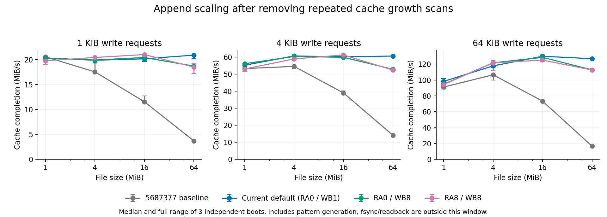
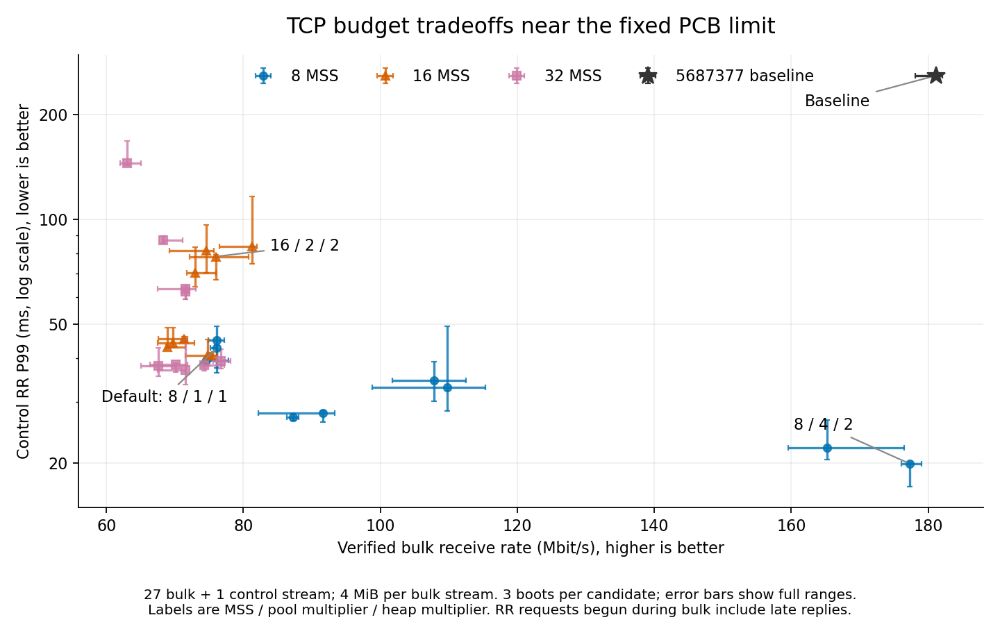

# 数据路径预算实验的输入与验收

## 已交付工具与当前证据（2026-10-06）

本页区分可运行候选、功能烟测、诊断与正式性能。阶段一至七与双盘纠错的代码、
正确性复核和匹配实验已交付：1,218 次发布构建启动、184 次诊断启动通过。实验结束时
默认仍为 8/1/1；随后用户批准网络默认改为 8/4/2，存储保持 RA0/WB1。下面历史表格
中的“默认”指当时的 8/1/1，不冒充调整后的新测量；具体收益、回退和边界见后文。

TCP 候选为 `w8/16/32-p1/2/4-m1/2/4` 共 27 组：窗口与发送缓冲为 8/16/32 MSS，
segment/pbuf 池及协议堆各自为 1/2/4 倍。PCB 数不变，32 MSS=46720 B，不启用窗口扩大。
存储为 `ra0/1/2/4/8-wb1/2/4/8` 共 20 组，预读/连续写回生产默认 0/1。配置校验
拒绝其他数值；候选由独立 BUILD_DIR 构建，不覆盖根 kernel-rv。

`tests/network-budget-experiment.py`、`tests/io-budget-experiment.py` 与共享
`tests/budget_identity.py` 把 family/profile、实际预处理宏、编译命令、编译器摘要及
源码身份绑定进 ELF 的非 ALLOC section，再记录最终 kernel SHA-256。运行同时核对
相邻 identity.json、ELF 内身份和真实文件摘要；canonical 标签必须匹配实际 profile，
`current` 只作显示别名。参数候选须来自同一保守源码集合（含未跟踪、非忽略输入），
整个 build 批次期间不得变动。运行时树身份与构建身份分开；固定旧基线和固定 Linux
明确作为例外，不猜测任意内核的配置。烟测可显式使用 unmanaged 普通标签，但不能
升格成正式性能；formal run 必须使用 managed 候选。

原基线为 `5687377c58dc96adfa1f72f1636a319bbd25b419`，本地复用缓存
`build/data-path-baselines/5687377/kernel-rv`，固定 SHA-256
`b962c890989d268282b55d49a4fa9b51afbaf7008dab2fc47e717388a6fea2f4`。
两工具支持 `--baseline` 指定同一摘要的文件，缺失或不匹配直接失败；不拿新构建冒充
该历史输入。可重建工作负载和内核源码均在 Git，缓存内核只是跨实验复用输入。

正式 release 至少三次独立启动，按 case/重复/variant 交错。每个 case 共用相同
ELF、初始镜像、QEMU、RAM、设备配置与缓存准备；每次启动复制磁盘。原基线自动加入，
Linux 只可通过 `--linux-kernel` 的固定源码/配置身份核验加入，保留 linux 标签。
TCP 与 I/O 的正式/诊断运行都取得 `build/cost/measurement.lock`；冲突先于构建或
启动客体被拒绝。该锁只约束合作工具，测量期间仍须停止其他编译/QEMU负载。
失败组标 incomplete，成功子集可保留诊断数据，但只有 status=measured 能用于比较。

## 负载与统计口径

网络 `all` 是 60 个明确 case：loopback/TAP、blocking/nonblocking、bulk/RR/mixed、
单/五/近池连接及方向。mixed 加一条独立控制连接，近池为 loopback 13 bulk+1 control、
TAP 27 bulk+1 control，留四个 active PCB 槽；这是 fixture 配额，不是协议优先级预留。
接收侧逐字节核对并确认全部连接完成，保存每连接起止时间和有效字节。准备阶段测
16 次 echo RTT；Jain 指标只描述有限完成速率，不作为长期无饥饿证明。
控制 tail 的主集合按 RR **发起时 bulk 尚活跃**选择，跨 bulk 结束的慢回复仍计入；
全部样本和 fully-contained 辅助集合另存，保留样本数，不按完成时点筛掉最慢请求。

loopback 的连接就绪与 RTT 预热完成使用两条独立放行管道。首次扩大验证在固定
Linux 的 blocking/RR/5 连接遇到 180 秒 workload timeout，结果文件为空；旧程序
两轮共用一条 gate，快客户端可能把慢客户端的第一轮 token 当成第二轮放行。
新增实际 workload 的宿主到达偏斜测试，旧代码稳定报告跨轮消费并停滞；分离后
通过。这里修改的是测量协调器，未改内核协议路径；新 workload ELF 必须与基线
重新匹配，旧失败批次标 incomplete，不混合两版 ELF 的吞吐或观测开销。

TAP 可选 `--tap-delay-ms 0/1/10`，只在隔离 namespace 的 host→guest egress 设置
netem，另报告实际 RTT。首次测量时宿主 1/10 ms 均返回 `Specified qdisc kind is unknown`，
在 QEMU 启动前明确记 unsupported。随后确认运行内核 7.2.7 与已安装的 7.2.8 模块不匹配；
重启后的补测见文末。原失败未改记为通过，也没有用另一种 relay 混作同一测量后端。
固定 ABI Linux 未启用 NETDEVICES，TAP 配置实测 ENODEV 后，另用既有
`tests/network-linux.config` 从固定 `references/linux@f4cdf7ca9a1fdcca413157df19753f388a5a224e`
构建网卡参考 Image（SHA-256 `7fdeac1a0821f821e02c15c35cd2c4003b66268a65b8ef591520094c096f442e`），
同 ELF loopback/TAP 功能已通过；原 ABI 参考保留。

存储 case 为 `backend:operation:completion:files:size:request`：ext4/tmpfs，
append/overwrite/cold-read/hot-read，1/4 个文件，每文件 1/4/16/64 MiB，请求 1/4/64 KiB。
overwrite 使用镜像已有文件且不 truncate；cold-read 是新 guest 首次读取预置文件，
hot-read 先完整验证读取一次。tmpfs read 是已建立的内存后备，拒绝 cold-disk 标签。
多文件由单任务逐请求轮转，不冒充并发调度公平性。cache 窗口没有显式 sync，fsync/
fdatasync 窗口在全部数据请求后每文件调用一次。setup、最后读回、cache 模式收尾同步
与结果文件持久化在主窗口外；模式生成、读校验及五个文件大小检查在主窗口内。
新 guest 缓存不表示冷宿主存储；tmpfs 同步成功不表示持久介质保证。

结果在传输/成本窗口结束后写客体文件并 fsync，退出后复制磁盘，只在读出副本重放
journal 再提取，保存原盘/读出盘/结果摘要。这样不依赖可能双向交错的串口记录。
COST 诊断另保存完整成本快照、32 位协议计数和协议池高水位；MEM_AFTER 仅为时点。
managed/heap peak 从初始化累计到查询前，排除未受管的内核映像/固件/MMIO，heap
为子集不可相加；不宣称 workload 独占峰值。release 与诊断扰动单独比较。

TX 诊断补充软件收割 DONE→FREE 和同槽 FREE→下一次 publish 的 count/sum/max，
单位由 `tx-clock-hz` 转换。范围是设备生命期，含准备和收口；后者也含正常空闲，
不能单独作为进展缺陷证据。复制 TX 的完成直接归还计零，首次使用和 reset-only
撤销不伪造完成时间。受控时钟测试先在缺记录实现上失败，补齐后两传输及 COST
开/关的实际驱动模型、worker 进展模型和结果解析测试通过。

## 已完成的功能验证

27 组 TCP 宏及非法覆盖、宿主工作负载与结果拒绝测试通过。框架审查先复现了错标签/
同 hash 假参数汇总、linux 标签绕过、完成筛选丢慢 RR、缺测量锁等问题，再加入身份、
边界长 RR 和锁冲突门禁。当时宿主测试为 network 10 组、I/O 6 组；后来加入跨屏障反例，network 为 11 组。它们不是性能结果。
实际 managed 构建还纠正了裸机 GCC 预处理缺 freestanding/kernel include 的问题。

此前同 RV64 ELF 网络近池 BoarOS/Linux 四启动、两次诊断通过；I/O 单 MiB 的
BoarOS/Linux 18 次 release 功能启动和两次诊断通过。新增 managed 身份与内存峰值后，
又验证两个 TCP mixed（loopback/TAP）及两个 RA8/WB8（追加 fsync/冷读）诊断启动，
均读出 peak>=current 和合法 COST 快照。所有记录为 functional-smoke-not-performance，
不生成性能分布，也没有把参数列表中的 64 MiB 全矩阵称为已运行。

最终 COST 契约复核曾捕获 `observer.journal_wait...` 一行被关机 network final
诊断插入，原始记录保留为失败。原因是 `fflush` 后 UART 队列尚未排空；沿已有
metadata workload 的边界，在 contract 正常退出前显式 `tcdrain`。该操作位于
全部观测窗口之后；不修改 COST 状态机，也不让解析器跳过坏行。修复后三次独立
启动、每次四个诊断窗口通过，原失败记录不计为成功副本。

```sh
python3 -B tests/network-budget-config.py
python3 -B tests/network-budget-selftest.py
python3 -B tests/io-budget-selftest.py
python3 -B tests/network-budget-experiment.py build --profiles all --jobs 4
python3 -B tests/io-budget-experiment.py build --profiles all --jobs 4
python3 -B tests/network-budget-experiment.py run --variant current=build/network-budget/kernels/w8-p1-m1/kernel-rv --cases loopback:blocking:mixed:5:tx,tap:nonblocking:mixed:5:rx --repeat 3
python3 -B tests/io-budget-experiment.py run --variant current=build/io-budget/kernels/ra0-wb1/kernel-rv --cases ext4:append:fsync:1:16M:64K,ext4:cold-read:cache:4:4M:4K --repeat 3 --timeout 600
```

`make prune-build` 保留身份绑定候选的 kernels/ 编译缓存及固定基线，清理 runs、镜像、
日志与汇总；核实后的永久结论和可重建命令在本页，不把被忽略的输出当作永久档案。


## 最终正确性复核

生产源码冻结于 `faf8e6395a7d56cd92e5fdb460fd9532066d2f26`。默认 `test-riscv`、
musl、glibc 2.44 五种 ELF 形态、1,344 条固定 Linux ABI 差分、epoll 同 ELF、
实际网络 owner ASan、VirtIO/worker/重组/块层/分配器抢占与 COST 宿主门禁通过。
I/O 暂扣四组合通过；双盘收口竞态修复后四组故障/重启、四组 FIFO/RR 和额外
30 次触发配置故障/重启通过。上述两个测试收口修复与原失败见各模块 learning。

1/4/16/64 MiB × 1/4/64 KiB 的 COST 规模门禁通过；64 MiB 对齐追加增长访问为零，
1 KiB 追加仅处理 49,152 次实际尾页。16,384 页缓存中的小范围写回只访问一个候选。
默认及 RA8/WB8、TCP32MSS/池4倍/堆4倍的编译栈门禁通过，最大单帧 3,152 B；
这不是整个调用链的栈上界，动态栈仍由各真实客体检查。

lwext4 完整恢复与阶段七后默认/RA8WB8 的 SQLite DELETE/WAL 完整矩阵均通过，
精确切点、实际故障命中和未到达项见[最终恢复](record-lock-sqlite-recovery.md#数据路径最终恢复与宿主收口2026-10-06)。
完整比赛 Harness 仍阻塞于缺少 `kernel-la`：固定
`references/oscomp-autotest@d1bb3a3c4b27274e196a2648518525c1a304e339/kernel/run.py`
要求启动 LoongArch 内核，当前 `make -n kernel-la` 无目标；上述 RV64 验收不算完整比赛通过。

## 正式匹配结果（2026-10-06）

最终发布构建纳入 **1,218 次独立启动**：TCP 27 组两负载筛选 168 次、同 27 组近池筛选 84 次、30 个扩展负载 450 次；存储 20 组两负载筛选 126 次、25 个扩展负载 375 次及 fdatasync 15 次。每个 case/variant 三次，全部接收/读回、完成和退出校验通过。网络使用修复屏障后的同一 ELF；旧版 252 次成功筛选及 Linux 超时的未完成扩展均不混入本节。30 个网络扩展负载是显式子集，并非 60 个 catalog 项的全笛卡尔积。诊断另有 **184 次**成功启动，不计入发布吞吐。

以下 `中位数 [最小值, 最大值]` 是三次独立启动的完整范围，不是置信区间。各比较只在同 case 内成立；不同完成语义、接收方向或缓存准备不能混为一个总分。应用模式生成/逐字节校验也消耗时间，结果不等同于 iperf 或 iozone 峰值，更不构成整体倍数承诺。

完整数值与身份直接纳入 Git：

- [发布指标表](data-path-budget-summary.tsv)：全部 406 个 case/variant 组的中位数与范围。
- [每连接／每文件完成表](data-path-budget-flows.tsv)：2,390 个 flow 的验证字节数、完成耗时及跨三次启动范围；`completion_from_first_ns` 从本次最早 flow 开始计算。I/O 的 `sync_from_first_ns=0` 表示未在窗口内显式同步，多文件轮转不是并发公平性证明。
- [发布输入表](data-path-budget-inputs.tsv)：每组 kernel/ELF/镜像/QEMU 摘要、源码身份、RAM 与 transport。
- [诊断指标](data-path-budget-diagnostic.tsv)、[诊断输入](data-path-budget-diagnostic-inputs.tsv)与[scope 字典](data-path-budget-diagnostic-scopes.tsv)：130 个组、184 次启动，`boots=1` 的峰值仅是一个观察样本；主要候选追加至三次。输入表的 `static_protocol_arrays_bytes=NA` 表示该实验未记录协议静态数组预算，不表示零占用。

### 追加规模与存储候选



图包含本轮全部数据路径改动，不能把整体差值全部归因于一条函数。独立复杂度门禁另证实增长不再走 inode 全页链。1 MiB 小文件的差别很小，64 MiB 的旧基线明显下降；生产默认在 1 KiB 请求下仍保持约 20 MiB/s。WB8 在 64 MiB 仅缓存完成的追加中较 WB1 慢，显式同步下则更快。

| 负载 | 5687377 | 默认 RA0/WB1 | RA0/WB8 | RA8/WB8 | 固定 Linux |
|---|---:|---:|---:|---:|---:|
| 64 MiB 追加，1 KiB，cache | 3.70 [3.63, 3.84] | 20.86 [20.23, 20.99] | 18.68 [18.57, 19.08] | 18.48 [17.20, 19.23] | 156.07 [149.20, 159.53] |
| 64 MiB 追加，4 KiB，cache | 14.15 [13.76, 14.50] | 60.61 [60.56, 61.04] | 52.83 [52.12, 52.93] | 52.37 [51.82, 53.63] | 246.53 [239.01, 246.79] |
| 64 MiB 追加，64 KiB，cache | 16.72 [16.57, 17.35] | 126.92 [126.73, 127.09] | 112.84 [112.59, 114.78] | 112.64 [111.20, 112.78] | 262.71 [261.92, 264.45] |
| 64 MiB 追加，4 KiB，fsync | 3.57 [3.57, 3.66] | 4.52 [4.51, 4.62] | 6.23 [5.86, 6.27] | 6.20 [6.18, 6.35] | 178.96 [174.95, 179.49] |
| 16 MiB 冷读，4 KiB | 26.71 [25.56, 27.16] | 25.53 [24.40, 26.40] | 25.00 [24.82, 26.54] | 36.66 [35.71, 36.91] | 259.95 [251.79, 266.72] |
| 16 MiB 热读，4 KiB | 134.09 [131.40, 135.03] | 132.33 [128.43, 134.20] | 129.95 [128.39, 131.06] | 135.69 [129.89, 136.93] | 294.89 [294.86, 296.37] |
| 16 MiB 原文件覆盖，fsync | 6.85 [6.80, 6.86] | 9.26 [9.19, 9.33] | 12.46 [11.98, 12.68] | 12.04 [11.75, 12.32] | 173.23 [164.95, 174.25] |
| 四文件覆盖，fdatasync | 5.02 [4.92, 5.20] | 8.31 [7.89, 8.44] | 10.92 [10.61, 11.04] | 10.89 [10.85, 10.90] | 141.84 [138.75, 143.07] |

表中单位为 MiB/s。tmpfs、其余大小/请求及四文件轮转全部在完整指标表；tmpfs 的成功不表示持久介质保证。热读范围重叠，不把微小中位差写成确定收益。Linux 使用自己的默认内核机制，它是整体程序参考，不是隔离某项 BoarOS 改动的实验。

20 组完整筛选如下。追加为单文件 16 MiB/64 KiB/fsync，冷读为四文件各 4 MiB/4 KiB；峰值列是诊断中受管页峰值的最大观察值，单位 MiB，排除静态内核映像。

| 候选 | 追加含 fsync MiB/s | 四文件冷读 MiB/s | 受管峰值：追加／冷读 MiB | 诊断启动数（每负载） |
|---|---:|---:|---:|---:|
| `ra0-wb1` | 6.25 [6.22, 6.53] | 26.04 [25.73, 26.27] | 20.49 / 19.76 | 3 |
| `ra0-wb2` | 6.97 [6.77, 7.06] | 25.65 [24.99, 25.69] | 20.47 / 19.76 | 1 |
| `ra0-wb4` | 7.48 [7.36, 7.48] | 24.30 [23.52, 25.97] | 20.54 / 19.77 | 1 |
| `ra0-wb8` | 8.15 [7.91, 8.24] | 25.26 [24.26, 26.26] | 20.72 / 19.79 | 3 |
| `ra1-wb1` | 6.38 [6.34, 6.43] | 23.94 [23.68, 23.98] | 20.52 / 19.77 | 1 |
| `ra1-wb2` | 7.08 [6.90, 7.25] | 23.22 [22.04, 23.22] | 20.50 / 19.77 | 1 |
| `ra1-wb4` | 7.51 [7.40, 7.58] | 21.85 [21.82, 23.70] | 20.55 / 19.78 | 1 |
| `ra1-wb8` | 8.12 [7.99, 8.23] | 23.44 [22.73, 23.49] | 20.60 / 19.80 | 1 |
| `ra2-wb1` | 6.28 [6.07, 6.35] | 25.75 [25.24, 26.15] | 20.48 / 19.77 | 1 |
| `ra2-wb2` | 7.01 [6.82, 7.05] | 25.75 [25.60, 26.35] | 20.50 / 19.78 | 1 |
| `ra2-wb4` | 7.41 [7.32, 7.46] | 25.24 [25.07, 26.04] | 20.49 / 19.78 | 1 |
| `ra2-wb8` | 8.06 [7.81, 8.22] | 25.11 [24.31, 25.29] | 20.73 / 19.80 | 1 |
| `ra4-wb1` | 6.53 [6.47, 6.66] | 31.58 [31.14, 31.85] | 20.48 / 19.77 | 1 |
| `ra4-wb2` | 7.00 [6.86, 7.09] | 30.60 [30.35, 31.44] | 20.43 / 19.77 | 1 |
| `ra4-wb4` | 7.31 [7.29, 7.44] | 31.54 [30.96, 31.65] | 20.52 / 19.78 | 1 |
| `ra4-wb8` | 7.99 [7.99, 8.04] | 31.02 [30.00, 32.14] | 20.66 / 19.80 | 1 |
| `ra8-wb1` | 6.44 [6.37, 6.60] | 35.53 [35.20, 35.55] | 20.48 / 19.77 | 1 |
| `ra8-wb2` | 6.96 [6.92, 7.10] | 33.81 [33.74, 34.44] | 20.53 / 19.77 | 1 |
| `ra8-wb4` | 7.53 [7.46, 7.56] | 34.16 [33.96, 35.93] | 20.55 / 19.78 | 1 |
| `ra8-wb8` | 7.99 [7.81, 8.25] | 35.13 [34.32, 36.08] | 20.73 / 19.80 | 3 |

### TCP 预算、尾延迟与内存



默认网络预算的吞吐回退是真实结果：减少 poll 扫描并不保证整个路径更快。8/4/2 在近池场景恢复接近旧基线的吞吐，并显著降低控制尾延迟；扩大窗口到 16/32 MSS 后，固定全局池更容易成为约束。不能把五连接的赢家自动推广到 28 连接，也不能由有限完成率 Jain 指标推出长期无饥饿。

所有候选的五 bulk＋一 control 筛选；单位 Mbit/s，每 bulk 4 MiB，nonblocking。loopback 为客户端向服务端发送（rx），TAP 为客体发送（tx）。

| 候选 | loopback 五连接吞吐 | TAP 五连接吞吐 |
|---|---:|---:|
| `baseline` | 244.41 [240.97, 244.67] | 204.91 [201.92, 214.12] |
| `w8-p1-m1` | 204.41 [201.97, 205.31] | 191.08 [190.51, 191.11] |
| `w8-p1-m2` | 209.29 [208.63, 214.31] | 185.45 [185.17, 191.20] |
| `w8-p1-m4` | 215.66 [209.99, 218.03] | 187.99 [185.27, 193.17] |
| `w8-p2-m1` | 217.60 [212.91, 220.47] | 187.02 [185.38, 197.52] |
| `w8-p2-m2` | 213.23 [209.39, 213.25] | 190.35 [184.67, 190.50] |
| `w8-p2-m4` | 212.69 [208.84, 215.89] | 186.34 [184.38, 189.05] |
| `w8-p4-m1` | 208.04 [204.83, 208.38] | 185.06 [173.80, 187.02] |
| `w8-p4-m2` | 207.40 [202.67, 210.16] | 195.96 [192.19, 200.24] |
| `w8-p4-m4` | 208.68 [208.01, 208.99] | 190.03 [178.30, 194.59] |
| `w16-p1-m1` | 244.54 [241.39, 245.73] | 203.04 [193.87, 219.17] |
| `w16-p1-m2` | 262.08 [252.24, 262.26] | 204.44 [203.41, 218.44] |
| `w16-p1-m4` | 255.17 [246.92, 258.91] | 194.27 [193.87, 204.69] |
| `w16-p2-m1` | 253.05 [250.02, 254.70] | 205.30 [201.68, 226.88] |
| `w16-p2-m2` | 256.95 [256.26, 263.25] | 206.95 [194.35, 217.86] |
| `w16-p2-m4` | 259.56 [258.38, 259.81] | 207.63 [203.40, 211.19] |
| `w16-p4-m1` | 258.48 [253.75, 259.14] | 199.49 [177.10, 210.37] |
| `w16-p4-m2` | 247.23 [245.34, 251.29] | 208.34 [207.73, 212.87] |
| `w16-p4-m4` | 250.79 [243.63, 254.74] | 204.76 [203.23, 206.17] |
| `w32-p1-m1` | 260.51 [255.19, 265.30] | 178.62 [167.98, 183.65] |
| `w32-p1-m2` | 283.09 [281.90, 284.92] | 173.31 [164.78, 187.56] |
| `w32-p1-m4` | 271.16 [266.14, 277.90] | 178.32 [175.35, 184.99] |
| `w32-p2-m1` | 256.13 [250.82, 269.57] | 201.25 [200.90, 207.45] |
| `w32-p2-m2` | 278.87 [275.18, 281.66] | 220.00 [210.10, 226.71] |
| `w32-p2-m4` | 285.61 [285.48, 286.72] | 219.07 [206.56, 221.50] |
| `w32-p4-m1` | 274.63 [268.40, 275.30] | 204.90 [201.56, 221.95] |
| `w32-p4-m2` | 272.55 [262.28, 279.66] | 228.98 [218.49, 237.15] |
| `w32-p4-m4` | 272.36 [250.67, 274.67] | 213.38 [194.95, 220.19] |

近池为 27 bulk＋1 control；RR 共 1,024 次，P99 只按 bulk 活跃时发起的控制请求取样，并包含其迟到回复。峰值取诊断副本的最大观察值；静态协议数组是编译预算，不等于实际占用峰值。PCB 上限保持 32，workload 留四槽；TCP segment/heap 没有每条控制连接的硬预留。

| 候选 | TAP 近池 Mbit/s | 控制 RR P99 ms | segment 峰值 | 协议堆峰值 KiB | 静态协议数组 KiB | 诊断 N |
|---|---:|---:|---:|---:|---:|---:|
| `baseline` | 181.13 [178.07, 182.05] | 258.82 [258.48, 259.02] | — | — | — | — |
| `w8-p1-m1` | 76.13 [75.19, 76.14] | 42.76 [36.29, 43.55] | 128 | 184.4 | 371.6 | 3 |
| `w8-p1-m2` | 74.58 [74.53, 77.85] | 39.45 [38.57, 40.22] | 128 | 182.6 | 627.6 | 1 |
| `w8-p1-m4` | 76.11 [74.92, 77.24] | 44.98 [37.58, 49.47] | 128 | 183.1 | 1139.6 | 1 |
| `w8-p2-m1` | 91.63 [82.14, 93.34] | 27.83 [26.28, 28.26] | 213 | 254.8 | 474.6 | 1 |
| `w8-p2-m2` | 107.80 [101.79, 112.49] | 34.57 [30.08, 39.07] | 256 | 340.4 | 730.6 | 1 |
| `w8-p2-m4` | 109.78 [98.78, 115.32] | 33.02 [28.21, 49.31] | 256 | 340.1 | 1242.6 | 1 |
| `w8-p4-m1` | 87.28 [86.34, 88.03] | 27.08 [26.45, 27.68] | 214 | 254.3 | 680.6 | 1 |
| `w8-p4-m2` | 177.27 [176.13, 179.08] | 19.93 [17.08, 20.08] | 320 | 346.8 | 936.6 | 3 |
| `w8-p4-m4` | 165.26 [159.55, 176.53] | 22.08 [20.50, 26.55] | 312 | 345.7 | 1448.6 | 1 |
| `w16-p1-m1` | 71.34 [67.57, 71.82] | 45.38 [44.59, 46.13] | 128 | 193.5 | 371.6 | 1 |
| `w16-p1-m2` | 69.73 [67.53, 72.85] | 44.25 [42.95, 48.85] | 128 | 194.2 | 627.6 | 1 |
| `w16-p1-m4` | 68.89 [68.72, 71.57] | 42.95 [42.66, 48.95] | 128 | 194.1 | 1139.6 | 1 |
| `w16-p2-m1` | 75.42 [75.03, 76.24] | 40.65 [39.57, 41.42] | 186 | 254.8 | 474.6 | 1 |
| `w16-p2-m2` | 76.03 [72.15, 80.74] | 78.31 [67.07, 79.36] | 256 | 391.5 | 730.6 | 3 |
| `w16-p2-m4` | 72.94 [71.72, 76.04] | 70.36 [64.11, 83.21] | 256 | 392.6 | 1242.6 | 1 |
| `w16-p4-m1` | 74.80 [71.54, 75.02] | 40.67 [38.05, 45.25] | 192 | 255.1 | 680.6 | 1 |
| `w16-p4-m2` | 74.59 [69.21, 75.68] | 81.25 [70.18, 96.34] | 383 | 511.2 | 936.6 | 1 |
| `w16-p4-m4` | 81.29 [76.46, 81.95] | 83.87 [74.53, 116.35] | 512 | 679.0 | 1448.6 | 1 |
| `w32-p1-m1` | 67.61 [65.09, 70.17] | 38.06 [35.57, 42.88] | 128 | 197.7 | 371.6 | 1 |
| `w32-p1-m2` | 70.15 [66.35, 71.84] | 38.46 [36.45, 38.80] | 128 | 196.8 | 627.6 | 1 |
| `w32-p1-m4` | 71.54 [67.51, 71.62] | 36.92 [33.55, 45.71] | 128 | 196.8 | 1139.6 | 1 |
| `w32-p2-m1` | 74.29 [73.96, 77.27] | 38.24 [36.84, 38.57] | 188 | 255.4 | 474.6 | 1 |
| `w32-p2-m2` | 71.56 [67.53, 73.01] | 63.34 [59.14, 64.70] | 256 | 396.1 | 730.6 | 1 |
| `w32-p2-m4` | 71.53 [71.49, 71.57] | 62.04 [59.00, 62.96] | 256 | 394.1 | 1242.6 | 1 |
| `w32-p4-m1` | 76.71 [75.57, 78.13] | 39.34 [37.40, 42.48] | 189 | 255.2 | 680.6 | 1 |
| `w32-p4-m2` | 68.26 [68.23, 71.10] | 87.13 [85.74, 89.61] | 377 | 511.6 | 936.6 | 1 |
| `w32-p4-m4` | 63.05 [61.97, 65.07] | 144.94 [143.45, 168.13] | 512 | 794.8 | 1448.6 | 3 |

实际应用 echo RTT（ms；每连接 16 次 64 B 请求，先取各连接 P50 的中位，再按三次启动报告范围）如下。近池 RTT 包含预热期间并发端点调度，不能代入一个纯链路 RTT 上界来解释全部吞吐：

| 负载 | 5687377 | 8/1/1 | 8/4/2 | 16/2/2 | Linux |
|---|---:|---:|---:|---:|---:|
| `loopback:blocking:bulk:1:tx` | 0.124 [0.122, 0.125] | 0.220 [0.204, 0.243] | 0.200 [0.200, 0.217] | 0.197 [0.195, 0.228] | 0.151 [0.150, 0.177] |
| `tap:blocking:bulk:1:tx` | 0.153 [0.147, 0.204] | 0.212 [0.149, 0.247] | 0.191 [0.189, 0.192] | 0.173 [0.171, 0.198] | 0.088 [0.073, 0.158] |
| `tap:nonblocking:mixed:near:tx` | 3.613 [3.534, 5.002] | 4.244 [3.985, 5.021] | 4.424 [4.005, 4.463] | 4.053 [3.898, 4.375] | 0.106 [0.050, 0.533] |

### 诊断解释与观察开销

所有 184 次诊断中的 `network_poll_services` 和 `network_runnable_sleep` 均为零；全局扫描并非全部为零，bind 冲突检查、销毁解绑和失败隔离仍有全局工作，不能把它们误记为 poll 的副作用。已知无接纳容量的零复制路径由独立 user-page-resolution 门禁保护。下表是近池、非阻塞发送中“复制后才遇到全局协议资源失败”的另一类成本。默认、8/4/2、16/2/2 各三次，8/4/1 和 8/2/2 各一次，诊断 N 也列在上表。

| 近池 TX 候选 | 接纳前阻塞次数 | 协议失败次数 | 零进度尝试新复制量 MiB | segment 峰值 | 协议堆峰值 KiB |
|---|---:|---:|---:|---:|---:|
| `w8-p1-m1` | 30609 | 91505 | 231.94 | 128 | 184.4 |
| `w8-p4-m1` | 50517 | 73514 | 199.25 | 214 | 254.3 |
| `w8-p2-m2` | 50365 | 41476 | 72.45 | 256 | 340.4 |
| `w8-p4-m2` | 34858 | 0 | 0.00 | 320 | 346.8 |
| `w16-p2-m2` | 19064 | 87167 | 261.25 | 256 | 391.5 |

`stream_copy_blocked_bytes` 仅统计请求尚无成功前缀时，本次新复制后遇到 EAGAIN 的字节；不覆盖短成功之后的未接受后缀。阻塞调用可能复用该缓冲，所以不能通称全部为浪费；上表是非阻塞模式，可用于描述零进度调用的重复复制。1 倍池触及 128 个 segment，4 倍池/1 倍堆又触及约 256 KiB 堆；8/4/2 同时满足本负载的两类需求。数据支持这个有限负载下的预算解释，不证明它是所有程序的全局最优。

完整诊断表另列每有效 bulk MiB 的 tcp_write、TCP 尝试发送/接收、唤醒及复制量。分母不含 mixed control 有效字节，但分子包含控制流与 epoch 内准备/收口；loopback 计两个客体端点，TAP 只计客体。协议统计为 32 位、有界本次负载，不能推广为无界运行计数器。

| 近池方向／候选 | DONE→FREE 均值 µs | 同槽 FREE→post 均值 µs | 同槽 FREE→post 最大值的三次范围 µs |
|---|---:|---:|---:|
| TX / `w8-p1-m1` | 1956.79 [1902.79, 2031.41] | 3539.22 [3426.83, 3553.31] | 6192515.60 [5794921.90, 16225373.10] |
| TX / `w8-p4-m2` | 537.88 [528.92, 546.64] | 1765.40 [1702.87, 1810.26] | 2403404.10 [2340538.20, 2882757.30] |
| TX / `w16-p2-m2` | 2183.44 [2120.04, 2203.64] | 3579.19 [3451.31, 3624.21] | 5098151.10 [4146368.40, 7034986.20] |
| RX / `w8-p1-m1` | 170.46 [167.53, 173.80] | 843.85 [823.78, 982.12] | 5755090.70 [2500018.00, 5900178.10] |
| RX / `w8-p4-m2` | 173.12 [169.77, 173.69] | 882.48 [880.45, 889.06] | 3020007.70 [2690630.40, 3650647.90] |
| RX / `w16-p2-m2` | 83.41 [83.24, 85.29] | 1437.71 [1324.29, 1558.95] | 2999329.30 [1999931.10, 3749744.30] |

上表均值先在每次启动内按 count/sum 计算，再报告三次的中位与范围。FREE→post 可以包含秒级空闲槽位；这不表示有可发数据却等待了同样时间。DONE 起点是软件收割 used ring，无法还原设备实际 DMA 完成时刻；计数从设备初始化到停止，包含准备和收口。软件进展由独立 completion-only 契约和 runnable-sleep 指标判断。

观察开销以下列匹配负载的延迟增幅表示：`release 中位速率 / diagnostic 中位速率 - 1`。每组 release/diagnostic 各三次，应用 ELF 相同；控制文件与 COST 开关不同。内核发布候选在 faf8e63 构建，诊断候选在 3891f7e 构建，两点之间仅测试/文档变化，生产源码、Makefile 与编译器相同。这是启用整套观测的扰动，不是 cost_add 单函数耗时；不得使用诊断吞吐替代发布结果。

| 负载／候选 | 发布速率，中位 [范围] | 诊断速率，中位 [范围] | 中位延迟增幅 |
|---|---:|---:|---:|
| `loopback:nonblocking:mixed:5:rx` / `w8-p1-m1` (Mbit/s) | 204.41 [201.97, 205.31] | 145.16 [144.14, 147.88] | +40.8% |
| `loopback:nonblocking:mixed:5:rx` / `w8-p4-m2` (Mbit/s) | 207.40 [202.67, 210.16] | 145.06 [144.28, 149.52] | +43.0% |
| `loopback:nonblocking:mixed:5:rx` / `w16-p2-m2` (Mbit/s) | 256.95 [256.26, 263.25] | 177.93 [161.90, 189.36] | +44.4% |
| `tap:nonblocking:mixed:near:tx` / `w8-p1-m1` (Mbit/s) | 76.13 [75.19, 76.14] | 47.80 [44.51, 48.38] | +59.3% |
| `tap:nonblocking:mixed:near:tx` / `w8-p4-m2` (Mbit/s) | 177.27 [176.13, 179.08] | 123.78 [119.59, 127.79] | +43.2% |
| `tap:nonblocking:mixed:near:tx` / `w16-p2-m2` (Mbit/s) | 76.03 [72.15, 80.74] | 49.75 [47.95, 52.62] | +52.8% |
| `tap:blocking:mixed:near:rx` / `w8-p1-m1` (Mbit/s) | 158.87 [149.33, 160.70] | 113.86 [110.50, 115.66] | +39.5% |
| `tap:blocking:mixed:near:rx` / `w8-p4-m2` (Mbit/s) | 154.09 [149.50, 162.08] | 112.19 [111.65, 113.77] | +37.3% |
| `tap:blocking:mixed:near:rx` / `w16-p2-m2` (Mbit/s) | 193.61 [187.01, 198.24] | 143.60 [139.58, 144.16] | +34.8% |
| `ext4:append:fsync:1:16M:64K` / `ra0-wb1` (MiB/s) | 6.28 [6.24, 6.50] | 5.17 [5.04, 5.22] | +21.6% |
| `ext4:append:fsync:1:16M:64K` / `ra0-wb8` (MiB/s) | 7.92 [7.73, 8.10] | 6.68 [6.68, 6.71] | +18.5% |
| `ext4:append:fsync:1:16M:64K` / `ra8-wb8` (MiB/s) | 7.93 [7.90, 8.14] | 6.40 [6.27, 6.81] | +23.8% |
| `ext4:cold-read:cache:4:4M:4K` / `ra0-wb1` (MiB/s) | 25.73 [24.99, 26.56] | 15.06 [13.46, 15.72] | +70.8% |
| `ext4:cold-read:cache:4:4M:4K` / `ra0-wb8` (MiB/s) | 25.21 [24.86, 26.21] | 15.17 [14.17, 15.18] | +66.2% |
| `ext4:cold-read:cache:4:4M:4K` / `ra8-wb8` (MiB/s) | 35.29 [35.00, 35.96] | 19.07 [17.94, 19.56] | +85.1% |
| `ext4:append:cache:1:64M:1K` / `ra0-wb1` (MiB/s) | 20.86 [20.23, 20.99] | 10.04 [9.25, 10.21] | +107.9% |
| `ext4:append:cache:1:64M:1K` / `ra0-wb8` (MiB/s) | 18.68 [18.57, 19.08] | 8.98 [8.92, 9.16] | +107.9% |
| `ext4:append:cache:1:64M:1K` / `ra8-wb8` (MiB/s) | 18.48 [17.20, 19.23] | 8.83 [8.77, 9.11] | +109.2% |

### 参数建议与未验证边界

- 缓存追加占主导、尤其小请求：保持 WB1；64 MiB 的 WB8 回退不能忽略。
- 顺序冷读占主导：RA8 值得在目标数据集继续验证；RA1 没有普遍收益。显式同步写占主导时 WB8 的收益更明确；同时需要两类负载可试 RA8/WB8。纯预读失败仍不污染无关 demand 或写回错误 owner。
- 接近连接池上限且重视控制尾延迟：本次优先候选为 `w8-p4-m2`，它增加全局资源而保留小窗口；五连接 bulk 优先的应用可另评估 `w16-p2-m2`。32 MSS 不是通用推荐，更多池/堆也未单调提高收益。
- 实验结束时 TCP 默认为 8 MSS、1 倍池/堆；随后用户批准 8/4/2。存储仍为 RA0/WB1，不因某一种同步负载更快而统一增大预读/写回。
- 本节只测本机 QEMU 11.1.1、单 hart、512 MiB、modern VirtIO、固定 ELF/数据集及当时主机条件。legacy 的正确性另有门禁，此处没有对应吞吐分布。echo RTT 来自 16 次 64 B 应用请求，包含端点处理与调度，不等同于 TCP 内部 SRTT。本节最初的 1/10 ms netem 创建失败；文末是重启后的独立补测。
- 三次范围不是充分统计置信度，也不支持实板、SMP、无限并发、长期无饥饿、所有 libc 应用或完整比赛 Harness 的结论。默认网络预算在若干吞吐负载的回退，以及全局协议资源失败后的重复复制，继续作为真实优化输入保留。


### 固定输入与重建

本轮内核 GCC 为 riscv64-elf-gcc 16.2.0；工作负载由 musl wrapper 调用
riscv64-linux-gnu-gcc 16.2.1 20260810。QEMU 11.1.1 可执行文件 SHA-256
`a1cfcceb6c688f9b0a290d512211ed08cf465b92b26a04cfb032280a53625718`。
正式 I/O ELF 为 `9503eba74d25afb7b0c6f63082c109e1594453a136488ef3dbb9141a7bb1a59f`；
正式网络 ELF 为 `74d890e6f969fcee5ffacf2795a61eeba40a7a6aad4f56719af5fc25982b406d`。
被替换的屏障版本 ELF `e604afdcaef170cd3fd0e772bf5471d8358937ed4ded37d28b35ae11473f3062`
不混入最终表。I/O Linux Image SHA-256
`45ce43a8d3809011e0a18538ac75a52e65a434614aa298517adcacb3e6f5410a`；
网络 Linux Image 身份见前文。精确每候选/镜像摘要在输入 TSV，所有原始场景
由 `tests/budget-cases.py` 重建，已逐项核对与此次 identity.json 相同。

下面在仓库根运行；输出目录须不存在。先完成构建，再串行测量，不能把编译负载
叠到吞吐测试上。重新构建会形成新源码身份和新测量批次，不冒充本页历史摘要。
固定旧基线必须存在且匹配摘要；候选缓存和固定 Linux 缓存由 prune 保留。

```bash
python3 -B tests/network-budget-experiment.py build --profiles all --jobs 4
python3 -B tests/io-budget-experiment.py build --profiles all --jobs 4

tcp_args=()
for window in 8 16 32; do
  for pool in 1 2 4; do
    for heap in 1 2 4; do
      budget_profile="w${window}-p${pool}-m${heap}"
      tcp_args+=(--variant "$budget_profile=build/network-budget/kernels/$budget_profile/kernel-rv")
    done
  done
done
python3 -B tests/network-budget-experiment.py run "${tcp_args[@]}" --repeat 3 --cases "$(python3 -B tests/budget-cases.py network-screen)" --output build/network-budget/formal-screen-v2
python3 -B tests/network-budget-experiment.py run "${tcp_args[@]}" --repeat 3 --cases "$(python3 -B tests/budget-cases.py network-near)" --output build/network-budget/formal-near-v2

io_args=()
for read_window in 0 1 2 4 8; do
  for write_batch in 1 2 4 8; do
    budget_profile="ra${read_window}-wb${write_batch}"
    io_args+=(--variant "$budget_profile=build/io-budget/kernels/$budget_profile/kernel-rv")
  done
done
python3 -B tests/io-budget-experiment.py run "${io_args[@]}" --repeat 3 --timeout 600 --cases "$(python3 -B tests/budget-cases.py io-screen)" --output build/io-budget/formal-screen

python3 -B tests/network-budget-experiment.py run --variant w8-p1-m1=build/network-budget/kernels/w8-p1-m1/kernel-rv --variant w8-p4-m2=build/network-budget/kernels/w8-p4-m2/kernel-rv --variant w16-p2-m2=build/network-budget/kernels/w16-p2-m2/kernel-rv --linux-kernel build/diff-abi/linux/908876a5eba85f78946a217361811c736d36d9203fd1504be83cbd38e80c1d00/arch/riscv/boot/Image --repeat 3 --cases "$(python3 -B tests/budget-cases.py network-expanded)" --output build/network-budget/formal-expanded-v2

for selection in expanded fdatasync; do
  python3 -B tests/io-budget-experiment.py run --variant ra0-wb1=build/io-budget/kernels/ra0-wb1/kernel-rv --variant ra0-wb8=build/io-budget/kernels/ra0-wb8/kernel-rv --variant ra8-wb8=build/io-budget/kernels/ra8-wb8/kernel-rv --linux-kernel build/diff-abi/linux/0931998a85a188a2fbf6b3c45543be49198ab0a4d6dfdb6b1c66247318d82c64/arch/riscv/boot/Image --repeat 3 --timeout 600 --cases "$(python3 -B tests/budget-cases.py io-$selection)" --output build/io-budget/formal-$selection
done
```

诊断先用相同 build 命令加 `--observe`，生成 `*-observe/kernel-rv`；run 同样加
`--observe --repeat 1`。所有 27 组 TCP 跑 `network-observe`（三个负载），所有
20 组 I/O 跑 `io-screen`；主要 TCP 候选 8/1/1、8/4/2、16/2/2、32/4/4 再分别
追加两次相同负载，主要存储候选 RA0/WB1、RA0/WB8、RA8/WB8 再追加两次。
后者还各跑三次 `io-copy-growth`；前三个 TCP 候选各跑三次 `network-receive`。
每次使用独立输出目录，诊断导出器只合并同 kernel/ELF/QEMU/RAM/transport 的组。

例如主要候选的三次接收诊断，以及环境能力检查：

```bash
for replica in 1 2 3; do
  python3 -B tests/network-budget-experiment.py run --observe --repeat 1 --variant w8-p1-m1=build/network-budget/kernels/w8-p1-m1-observe/kernel-rv --variant w8-p4-m2=build/network-budget/kernels/w8-p4-m2-observe/kernel-rv --variant w16-p2-m2=build/network-budget/kernels/w16-p2-m2-observe/kernel-rv --cases "$(python3 -B tests/budget-cases.py network-receive)" --output build/network-budget/observe-receive-$replica
done
# 本宿主下面两项在 qdisc 创建时 unsupported；非零退出不能标为通过。
for delay in 1 10; do
  python3 -B tests/network-budget-experiment.py run --variant w8-p1-m1=build/network-budget/kernels/w8-p1-m1/kernel-rv --repeat 3 --cases tap:nonblocking:bulk:1:tx --tap-delay-ms "$delay" --output build/network-budget/delay-${delay}ms
done

python3 -B tests/budget-report.py --output docs/learning build/io-budget/formal-screen build/io-budget/formal-expanded build/io-budget/formal-fdatasync build/network-budget/formal-screen-v2 build/network-budget/formal-near-v2 build/network-budget/formal-expanded-v2
python3 -B tests/budget-diagnostic-report.py --output docs/learning/data-path-budget-diagnostic.tsv build/network-budget/observe-all build/network-budget/observe-selected-2 build/network-budget/observe-selected-3 build/network-budget/observe-receive-1 build/network-budget/observe-receive-2 build/network-budget/observe-receive-3 build/io-budget/observe-all build/io-budget/observe-selected-2 build/io-budget/observe-selected-3 build/io-budget/observe-copy-growth-1 build/io-budget/observe-copy-growth-2 build/io-budget/observe-copy-growth-3
# 历史图也可直接由 Git 中的汇总表重建，无需保留运行镜像；本轮 matplotlib 3.10.6。
python3 -B tests/budget-plot.py --table docs/learning/data-path-budget-summary.tsv --output build/budget-plots
```

发布表和诊断表已由原结果重新导出，逐字节比对一致；图从 Git 中的表重新生成并目视
检查。导出器拒绝未完成/非对应模式、重复启动或输入身份冲突，不把缺数据填成零。
记录结论后按项目规则清理运行镜像、日志和临时探针，保留可复用候选/固定基线/工具链缓存。

## 受控延迟与原版五项评分补测（2026-10-06）

用户重启后，宿主为 `7.2.8-zen1-2-zen`，运行内核与 `sch_netem` 模块版本一致。
隔离 namespace 中实际创建 1 ms netem 成功，随后补跑 1/10 ms。这里设置的是
host→guest 单向延迟，不能直接称为固定 RTT；实际 echo RTT 另列。未重建候选，
复用此前 main 的关闭 COST 发布内核；五项原版评分则使用同步主线后的兼容分支。

### RV 原版五项成绩

`oscomp-rv-compat` 单向合入 main 后为 `a9fdc9e`，保留兼容 uname 与启动配置。
仅选择 iozone、cyclictest、iperf、libcbench、lmbench，按此顺序分别运行 glibc/musl，
一次 QEMU 启动，1 hart/1 GiB、原 Harness 设备参数，COST 关闭。没有跑 LTP 或其他组，
没有追加回归、诊断构建或重复启动。十个原脚本均到达结束且返回 0，经过 704.268 秒。
使用固定 `references/oscomp-autotest@d1bb3a3c4b27274e196a2648518525c1a304e339`
的原 parser/judge；原发布镜像为 pre-20250615，程序与脚本未改。

| 项目 | musl | glibc | 每种 libc 的分数上界 | 原 judge 指标数 |
|---|---:|---:|---:|---:|
| iozone | 28.3247 | 28.6106 | 40 | 20 |
| cyclictest | 7.3915 | 7.4545 | 8 | 4 |
| iperf | 6.0000 | 6.0000 | 12 | 6 |
| libcbench | 30.0344 | 37.3851 | 54 | 27 |
| lmbench | 51.4950 | 51.5927 | 72 | 36 |

[186 项原 judge 数值](oscomp-rv-five-results.tsv)保留实际结果、内嵌参考值及逐项分数。
`judge_reference` 是原 judge 的历史内嵌数值，既不是 5687377，也不是本次新测 Linux。
原性能 judge 对有效但低于参考的结果仍给 1 分，所以正分不能证明接近参考性能。
本次是 RV 五组的一次原版评分，不是完整双架构 Harness 或三启动性能分布。

| 原 iperf 接收端 TCP，Mbit/s | musl | glibc |
|---|---:|---:|
| 单连接 | 229 | 226 |
| 五连接合计 | 319 | 285 |
| 反向单连接 | 227 | 227 |

这些是本次原脚本的真实接收输出，不能用上一节自写 bulk 的数值代替。
三种 TCP 均低于 judge 内嵌参考，各得 1 分；UDP 三项也各得 1 分。
与此前单 TCP 250/274、五 TCP 359.9/355.5 的历史中位数相比，本次更低，
但历史是另一轮三启动兼容配置，本次只有一次，不宣称已经隔离出变化原因。

cyclictest 继续报告 `mlock Function not implemented`。glibc 的压力八线程计数为
`1000,667,500,40,34,0,0,0`，后三条没有有效延迟样本；musl 八条都有样本。
原 judge 的 `Min:\s+` 正则不匹配零样本行的 `Min:1000000`，glibc 压力八线程
397 µs 实际只平均了五条记录，不能把 7.4545 分解读为八线程均稳定运行。
这里保留原 judge，不改公式或补造样本。

所有组结束并打印 `BOAROS-EVAL COMPLETE` 后，内核最后报告
`root boot error status=0xb`。该值是 `RISCV_ROOT_BOOT_STATUS_CLEANUP`，不是 errno。
网络/rng 收口已完成；最后失败的下层 owner 未在本次日志中打印，仍待定位。
报告保留 `guest-boot-error`，不能将这次启动写成完全无错误通过；应用测量与分数
均在此错误之前输出。没有为消除这条记录重跑五组或展开存储恢复矩阵。

重建仅需：

```sh
git switch oscomp-rv-compat
python3 -B tests/oscomp/run.py --groups benchmarks --output build/oscomp-rv-five-new
```

新增 `benchmarks` 只选择这五个原组。常规 runner 复用已核对的发布输入；
四个 RV/LA 大文件的哈希复查改为显式 `--verify-inputs`，不再作为每次评分的前置扫描。

### 1/10 ms 单向延迟结果

仅比较原基线、默认 8/1/1 和已有证据的近池候选 8/4/2。两个负载为 TAP 非阻塞
单 bulk 与 27 bulk＋1 control，bulk 每条 4 MiB。每组三次独立启动，共 36 次，
全部内容/完成检查成功，netem 没有丢包。QEMU 11.1.1、1 hart/512 MiB、modern；
实测 RTT 是每连接 16 次 64 B echo 的中位数，再在连接和启动间取中位数。
没有展开 27 组参数，也没有诊断构建或无关回归。

| 单连接配置 | 1 ms 吞吐 Mbit/s | 实测 RTT ms | 10 ms 吞吐 Mbit/s | 实测 RTT ms |
|---|---:|---:|---:|---:|
| 5687377 | 75.80 | 1.243 | 8.69 | 10.506 |
| 默认 8/1/1 | 74.78 | 1.459 | 8.68 | 10.726 |
| 候选 8/4/2 | 75.05 | 1.423 | 8.67 | 10.719 |

| 近池单向延迟／配置 | 吞吐 Mbit/s，中位 [范围] | 控制 P99 ms，中位 [范围] | 准备阶段实测 RTT ms |
|---|---:|---:|---:|
| 1 ms / 5687377 | 181.76 [181.55, 183.11] | 259.88 [257.81, 507.09] | 3.485 |
| 1 ms / 8/1/1 | 77.71 [77.34, 77.77] | 40.14 [38.16, 41.95] | 3.810 |
| 1 ms / 8/4/2 | 189.51 [181.21, 192.09] | 17.73 [17.59, 20.76] | 3.921 |
| 10 ms / 5687377 | 97.39 [96.67, 100.06] | 261.78 [261.64, 512.02] | 10.319 |
| 10 ms / 8/1/1 | 75.21 [74.23, 75.37] | 41.71 [40.22, 42.37] | 10.391 |
| 10 ms / 8/4/2 | 177.72 [151.40, 180.67] | 19.73 [19.35, 31.84] | 10.332 |

[完整聚合范围](data-path-controlled-delay.tsv)包含上述 12 组。10 ms 候选的范围较宽，
保留全部三次而不挑选最快样本。0 ms 的旧报告发生于重启前，不冒充同一宿主内核
的新对照。单连接没有池/堆扩大收益；8 MSS=11680 B，在约 10.7 ms 下的窗口演算
约 8.7 Mbit/s，与实测接近，这是窗口约束的解释依据，不是独立隔离证明。

两个 run 串行执行，且在五项原版评分结束后启动：

```sh
for delay in 1 10; do
  python3 -B tests/network-budget-experiment.py run --variant w8-p1-m1=build/network-budget/kernels/w8-p1-m1/kernel-rv --variant w8-p4-m2=build/network-budget/kernels/w8-p4-m2/kernel-rv --cases tap:nonblocking:bulk:1:tx,tap:nonblocking:mixed:near:tx --repeat 3 --tap-delay-ms "$delay" --output "build/network-budget/delay-${delay}ms-new"
done
```

### 实现路线、候选与选择标准

实现路线已由用户确认：短 syscall＋有界 worker 保留低延迟提交并明确协议执行资格；
脏页链＋哈希利用现有局部索引；TCP reservation 只预约接纳字节，继续 COPY，避免
引入稳定到 ACK 的内容生命周期。全邮箱会增加每次小请求排队/调度，TCP 重写与
跨层预约扩大验证和所有权成本，统一大树也不是消除增长扫描所必需，故本轮未选。
这些是实现取舍，不是已经实测击败了所有替代架构。

参数标准是正确完成、接收有效吞吐、控制尾延迟、内存代价和目标负载的稳定收益。
0 ms 近池的 8/4/2 为 177.27 Mbit/s、P99 19.93 ms；8/4/4 为 165.26、22.08，
增加堆却无收益；16/2/2 为 76.03、78.31；32/4/4 为 63.05、144.95。五连接的
16/2/2 则更快，说明不能跨负载推广。此次延迟补测支持 8/4/2 作为高并发候选，
但没有比较长 RTT 下的 16/32 MSS，单连接窗口参数尚未由本次比较选出。

存储同理：WB8 将 64 MiB fsync 追加从默认 4.52 提高到 6.23 MiB/s，却将缓存
1 KiB 追加从 20.86 降到 18.68；RA8/WB8 的顺序冷读 36.66 对默认 25.53 有收益。
因此按负载推荐，不能统一开启所有更大值。生产仍 TCP 8/1/1、RA0/WB1；本轮未
自动采用候选。后续以原版目标程序和直接相关回归为主，不因小改动重跑全部矩阵。
